# IPython 基础
* IPython 一些快捷键：
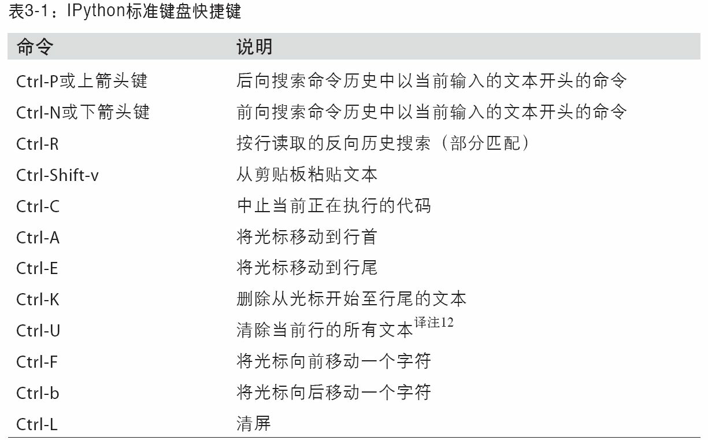
* %timeit 用于检测任意python语句的执行时间
* aotomagic 打开或关闭 不带百分号使用魔术命令   
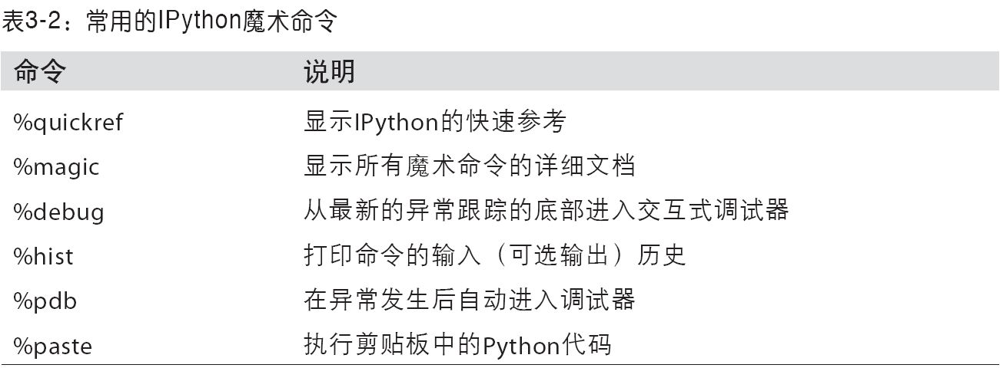   
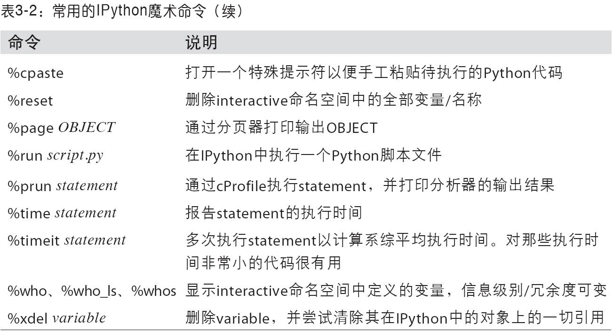
* 在启动IPython 时加上 --pylab来集成matplotlib
* 最近的输出结果保存在 _ 和 __ 这两个变量中。输入和输出的命令都保存在 \_xx 和 \_ixx 中，可以用exec \_xx 来执行第xx行
* %hist用来打印全部或部分输入历史、%reset用来清空interactive命名空间、%xdel用来从IPython中移除特定对象的一切引用
* 执行%logstart可开始记录日志，此外还有%logoff 、%logon、%logstate 以及%logstop   
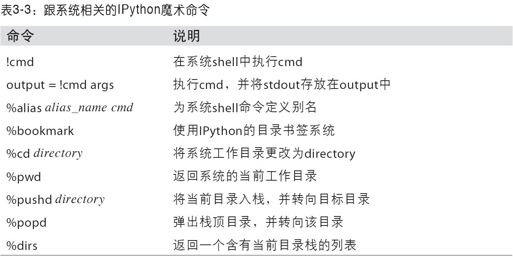   
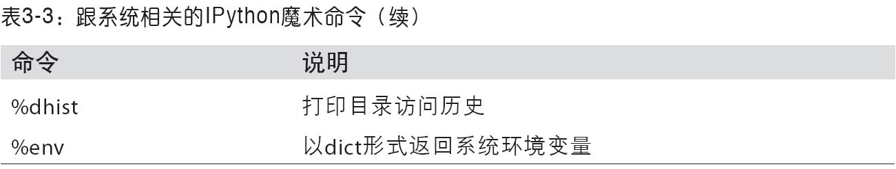
* %alias 可以为shell自定义简称， 如 ``` %alias ll ls -l ```
* %debug 会调用 “ 事后 ” 调试器，并直接跳转到引发异常的哪个栈帧，使用u 或 d 可在栈跟踪的各级别之间切换
* %pdb 可以让IPython 在出现异常之后自动调用调试器
* 使用带 -d 选项的 %run 命令，将在执行脚本文件中的代码之前先打开调试器，必须输入s 才能进入脚本。输入c 是脚本一直运行到断点为止。使用n 执行到下一行。 变量前加上！即可查看其内容。   
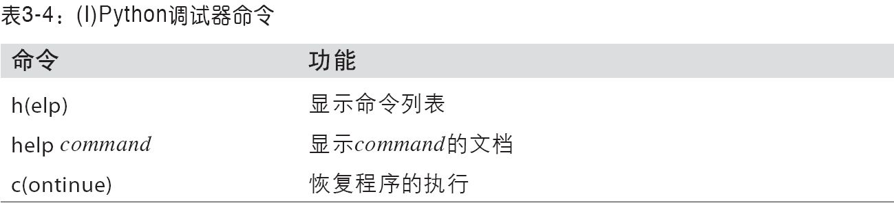   
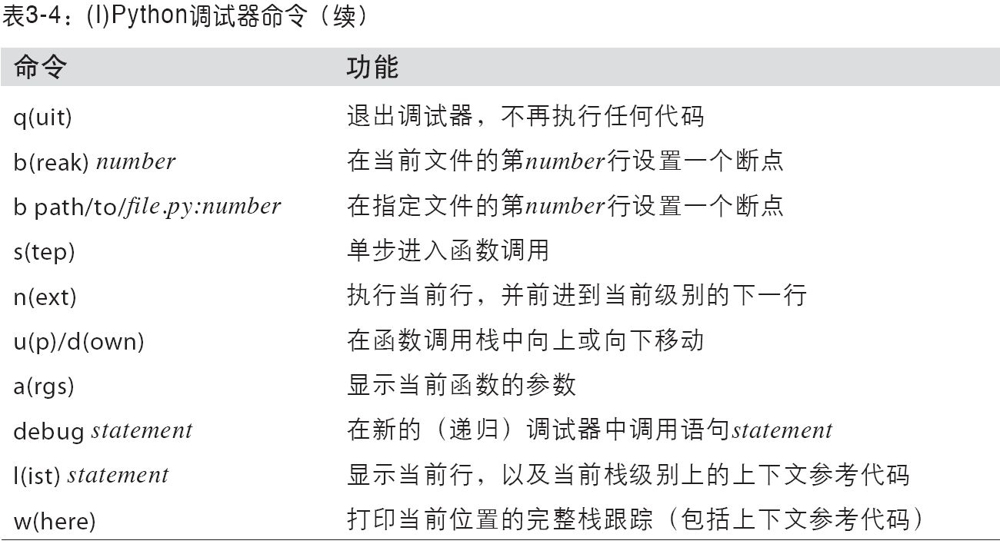
* 扁平结构优于嵌套结构、无惧大文件

# NumPy 基础
## ndarray ： 多维数组对象
* 使用array 函数转换一切序列型的对象。嵌套序列会被转换为一个多维数组。如：
```python
data1 = [6, 7.5, 8, 0, 1]
arr1 = np.array(data1)
```
* 数据类型保存在dtype 对象中
* 实用化zeros 和ones 可以创建指定长度或形状的数组。empty可以创建一个没有任何具体数值的数组
* arange 是 Python 内置函数的数组版
* 可以使用 astype 函数显式转换数组的 dtype
* 大小相等的数组之间的任何算术运算都会将其运算应用到元素级
* 当把一个标量值赋值给一个切片时，该值会自动传播
* 二维切片：   
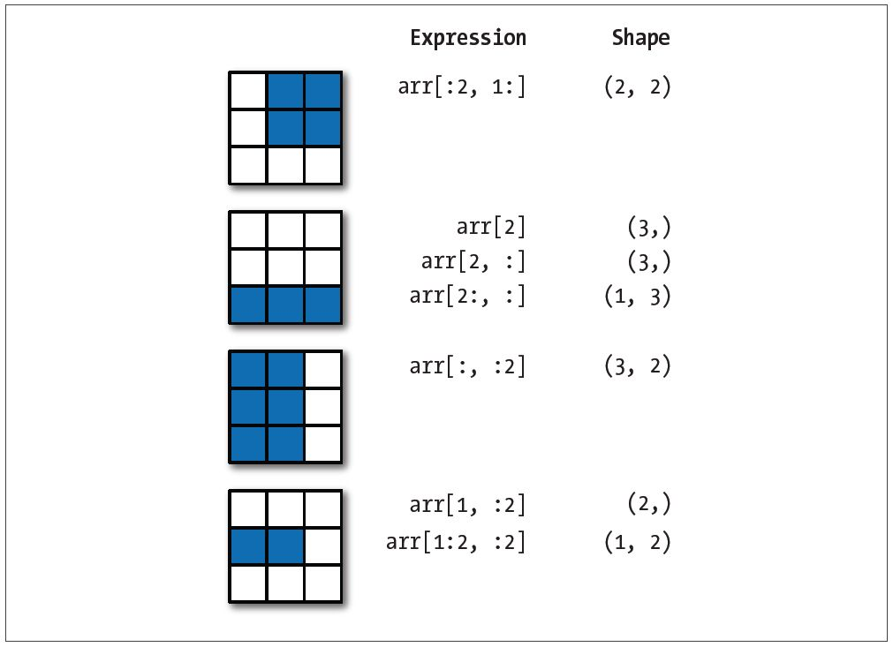   
* Python 关键字and 和or 在布尔型数组中无效

## 通用函数
* 一些一元和二元ufunc   
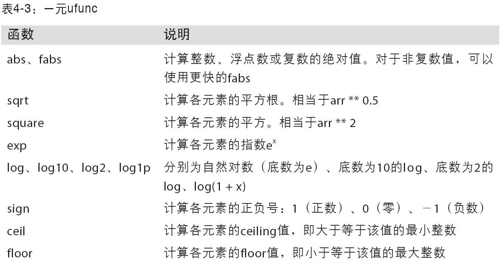   
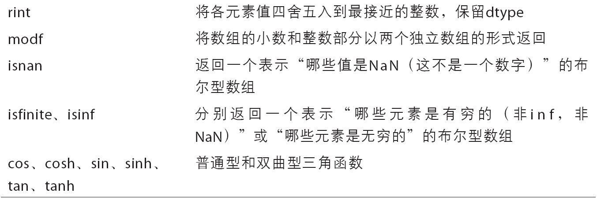   
   
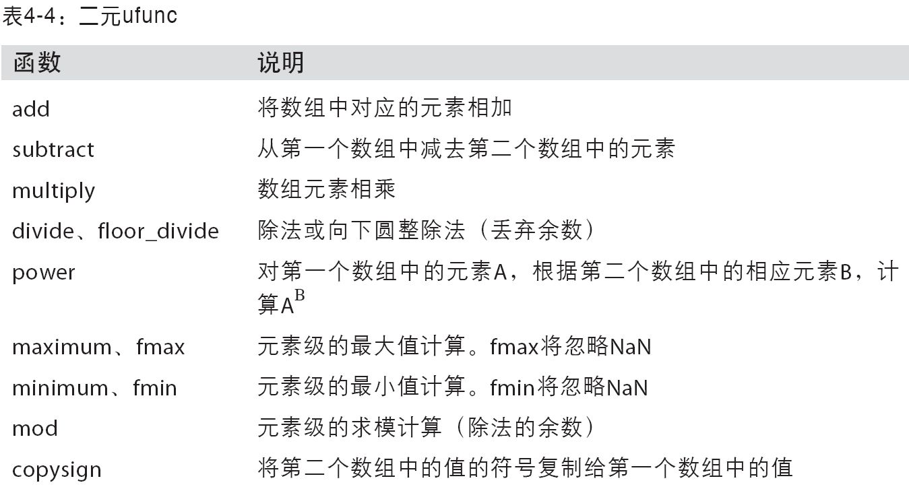   
   
* meshgrid 函数接受两个一维数组并产生两个二维矩阵
* np.where 时三元表达式``` x if consition else y ```的矢量化版本。使用如下：
```python
In [140]: xarr = np.array([1.1, 1.2, 1.3, 1.4, 1.5])
In [141]: yarr = np.array([2.1, 2.2, 2.3, 2.4, 2.5])
In [142]: cond = np.array([True, False, True, True, False
In [145]: result = np.where(cond, xarr, yarr)
In [146]: result
Out[146]: array([ 1.1,  2.2,  1.3,  1.4,  2.5])])
```
* 基本的数组统计方法函数：
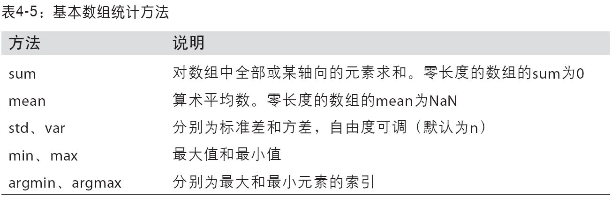   
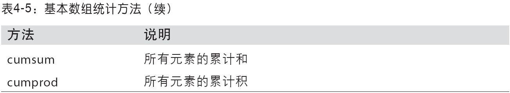   
* any() 用于检测数组中是否存在True， 而all() 则检查是否数组中所有值都是True
* sort() 可用来给数组排序，多维数组可传入轴编号
* 数组的集合运算
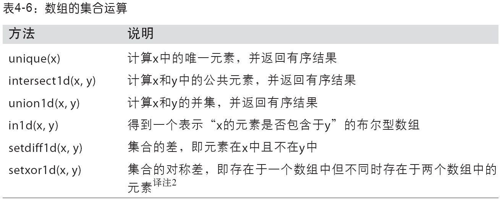   
## 文件
* 使用save('file_name', arr) 和 load('file_name.npy') 读写。默认情况下，数组是以未压缩的元是二进制保存在.npy 文件中
* 通过np.savez('file_name.npz', a = arr, b = arr)可以将多个数组保存到一个压缩文件中，将数组以关键字参数的形式传入即可。使用load('file_name.npz') 进行延迟加载

## 线性代数
* 使用dot(x, y) 进行矩阵乘法
* 常用的numpy.linalg 函数：   
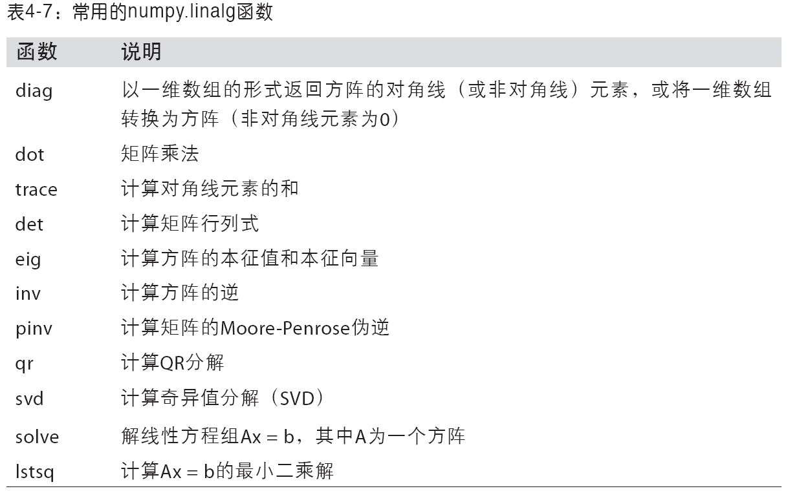      

## 随机数生成
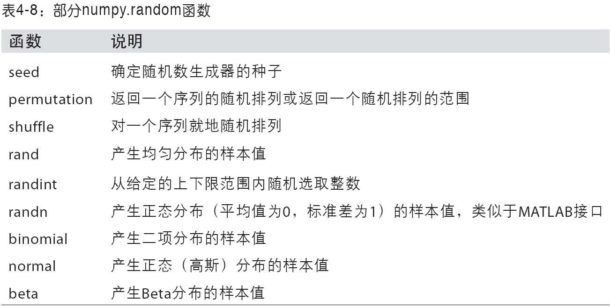   
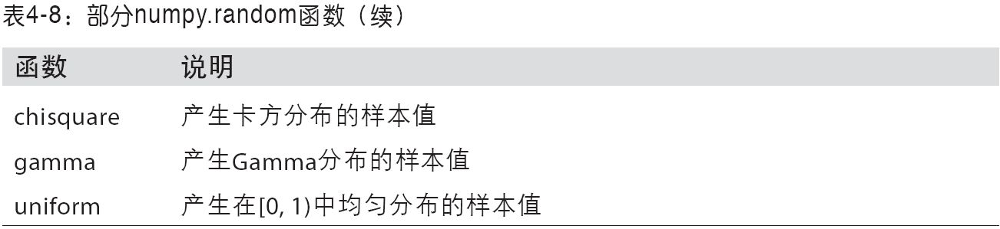   


---
*参考资料：《利用Python 进行数据分析》*
