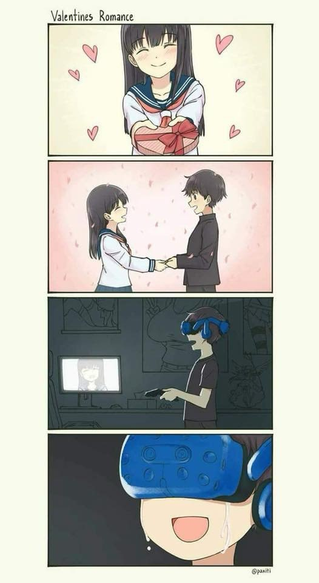

23年也很快过去了，果然成年人的时间就像银行卡里的钱一样，不知道什么时候就都流光光了。

<i>也有一种说法是时间都被马桶冲走了——有兴趣的朋友可以尝试不要使用马桶  </i>

---

今年是动荡的一年，发生了各种各样的事情：暑假回国和佳订婚；博士顺利毕业；确定了要创业而不是找工作的想法；开始申请加拿大的永居，心态上也有了相比两年前几乎是翻天覆地的变化。

---

暑假的时候和佳一起回国订婚，这本来不在计划之内。佳父母催的着急，说我们因为疫情好多年都没有回国，这个暑假回国一定要趁机把婚定了，给双方家长一个交代。我父母说是没有意见，但其实也蠢蠢欲动要催我们，佳也说就订个婚嘛，没什么大不了的，就吃个饭就好了。我说行吧。具体的事情就莫名其妙教给双方家长商量了，但这似乎是个错误的决定——佳的父母想趁机炫耀我这个说出去还有点唬人的女婿，我父母也生怕丢面子被人看不起，结果参与人数和预算一飞冲天，导致中途佳和她父母还吵了一架，搞得我们都很愧疚。

但终究，花钱就花钱呗，我们在西安最好的酒店（之一）举办了仪式，陪一众亲朋好友（四十多人）在西安玩了两三天。说是玩，但其实大家一直在喝酒，饭也都剩了不少。然后我们又去她家里玩（喝酒）了一周。总之是玩了很多。值得一提的是我全程滴酒未沾（在这种环境下也是个很大的成就了！）。

在订婚的前一天上午，我和佳一起顶着大太阳在城墙上跑了全程14公里（最后的四公里生不如死，但还是坚持下来了）（佳也很牛逼，愿意在订婚前一天在大姨妈期间和我一起跑城墙14公里，也是个狠人）。然而当天晚上的时候订婚的场地还没有布置好，我和佳骑着破破烂烂的共享单车花了大半个小时去酒店去帮忙吹气球到十二点多。

不知道为什么我脑海里一直重复着那天晚上的场景：我和佳在夏夜的人山人海中焦急得找共享单车，但是每一个都用不成，最后，我用脚划着链子坏掉的共享单车，和不怎么会骑自行车的佳花了半个多小时，汗流浃背赶去高档酒店，然后在空旷昏暗的订婚大厅里和几个帮忙的大哥们对着几乎是一片凌乱的背景装饰一起吹气球挂气球直到凌晨一点才回家，一边担心着这几个粗小伙子们该怎么能把这一团糟布置好。但是第二天等我们去现场的时候，整个布置确实像有魔法一样变得整齐，甚至浪漫起来了。

<i>凌晨一点时的现场，依然有些凌乱…… </i>

订婚的一个明显体验就是亲朋好友真的很热情，搞得我很不好意思，因为很多人我并不熟悉，甚至不认识。但是大家都很努力想把订婚的事情做好（可比我的动力大多了），还是很感动的。另一个体验就是，人厉害的时候真的是可以为所欲为的。上次回国去见佳的父母被灌了很多酒，后悔得要命；这次回国明显好了很多，我说不喝酒之后，几乎没有人继续劝下去。我猜这是因为我从一个普通的硕士生变成了即将毕业的博士，地位上升了（不少亲朋好友一直在说我很厉害什么的，可能是学历吧，毕竟我们也没很深入交流过），但也可能是别的原因。

---

相比订婚来说，博士毕业确实是在计划之内。当时的计划是这样的：暑假回国之前提交加拿大签证申请、回国订婚、回法国写毕业报告答辩、十二月去加拿大。目前来看，订婚和毕业算是顺利的两件事。事实上，博士答辩比我想象中要轻松很多。写博士论文我一共花了大概一个月，把各种发表过的投过的文章复制粘贴重新整理一遍，然后补充了一些东西，用ChatGPT写了很多介绍和研究现状的内容。但是事实表明，ChatGPT能力确实有限：它独立写出来的东西后来让我非常尴尬，Cristina说你怎么能这样写论文呢，只有政客才会这么说话啊。于是我们几乎完全重写了ChatGPT的那部分。但是总的来说，ChatGPT还是帮了不少忙。

最有意思的事，博士最后几个月我几乎一直在写我自己项目，中途用了地狱般的两周和导师们一起赶deadline把博士论文大改了很多遍，每天处在崩溃边缘。之后我没有休息又马上开始写自己的项目。好在rapporteurs给的反馈非常好，没有任何需要改动的地方。后来这个版本就直接当作最终版本提交上去了，没有改任何地方。

但是我在答辩前一周不知道怎么给感冒了，严重到有一天晚上我睡觉的时候，穿着两层保暖内衣、最厚的毛衣和羽绒衣，然后上面盖着三层厚被子和最厚的睡衣，电暖气在床头开到最大，才感到没那么冷。脑子一直是蒙的，和导师们练习答辩的时候，我几乎坐不到桌前（太冷了），然后用几乎不怎么运转的脑子和老师坑坑巴巴讲了40分钟。导师们看到我病成这样也不好意思说我讲的很烂，Cristina开玩笑说你就算感冒了到时候答辩你也得来！哪怕你带着被子也行。我说那肯定的，我只要没死就来。

好在之后两天恢复很快，我强迫自己吃很多喝很多，一直休息，每天练两三遍，等到答辩的时候，几乎精力已经完全恢复了，讲的时候也非常顺利，但是还有些咳嗽。我为此专门准备了水，结果还是中途咳嗽了好多次，等到后来我咳嗽的时候自己都在笑，jury们也都在笑。

但是答辩效果很好，提问阶段大家态度也都很好，没有问任何奇怪或者刁钻的问题，简直要把我夸到天上去的程度。8个jury成员，算上答辩一共花了两个来小时就全部结束了，比我预想的要快很多。我的导师说反馈很好，大家都惊讶我的法语这么好——这得多亏其他中国同学的衬托——而且讲的东西覆盖面很广，非常pédagogique。还有个老师专门跑过来跟我说他看我的论文学到了很多东西，让我还挺开心。Cristina说我是Morgan带的第一个博士生，算是给他一个好学生的典范，我说好嘞谢谢。

<i>感谢JJ用美颜相机拍的答辩问答环节 </i>

另一个很感动的事情就是竟然有很多朋友同事来我的答辩，这是我意想不到的。我一直觉得自己不怎么社交，朋友很少，但是答辩的时候，公司很多朋友都来了（Paolo, JJ, Ovidiu, Charef，还有一些同事或者上级：Eric, Amal, Nancy...），还有很多其他朋友（金刚，怀，黄姐，艾童，赵晨阳阿布两口子，啦啦，金锋两口子），还有碰巧来巴黎看五月天演出的小雷和雪胜，还有学校实验室的很多朋友。小雷和怀还各自送了我一大捧花，啦啦送了我一个巴黎的那种立体的带各种旅游景点的小本子，金刚、金锋、瑛蕾还有艾童他们都帮忙布置了pot。非常感谢，让我感到出人意料得被受欢迎。Ovidiu后来走的时候告诉我说别再说谢谢了，你今天都说几百遍了，我才反应过来。

---

其实我并没有把博士毕业当作一个很困难的事情。它确实很重要，但是并不怎么累——无论如何都是能毕业的。累的事情是我从来没有做过而且比读博更有挑战的事情：创业。这个想法其实有了很多年了，但是今年算是认真实践的第一年。主要是多亏了ChatGPT。因为这个东西横空出世，很多创业的机会出现了，然后我就开始认真考虑怎么借着这个机会财务自由。一年时间想了不少项目，也都认真动手做了。

第一个想法是全智能的语音笔记，用户可以对着手机说一大堆乱七八糟毫无逻辑的话，然后由语言模型总结归纳整理成有序的笔记，搜索功能也可以由语音/打字+传统的搜索完成。这样最简化用户输入的过程，把写作/记笔记这种需要整理思想的过程交给AI，可以节省很多时间和精力。我感觉这个想法很不错，但是项目规模完全超出了当时的我的能力范围，更何况我选择了flutter来写代码，更是噩梦一般的体验（生态缺乏）。

另一个是自动炒股推荐平台，用自然语言分析每日新闻和数据，给人推荐对应的股票和经济分析。这个想法也不错，但是我一个经济/金融小白，只看过几本经济学概论，也不认识很多相关行业的人，做这个自然是很勉强。于是10月初的时候下定决心再次放弃，开始做智能的法语考试辅导平台。主要是我看到很多人用ChatGPT的API做出了雅思托福的辅导平台，但是法语方向的还完全没有类似的网站。我问了几个考过法语的朋友，他们也不知道有什么好用的辅导平台。所以就这么开始了，直到现在。希望我成功吧。

今年还半开玩笑地给一些朋友说了我以后想要搞太空采矿的计划。很多稀有金属、能源在月球、火星、小行星带上都挺常见的，如果能开采的话，肯定会是另一波科技革命。这个想法似乎有些过于遥远，但是谁知道呢，万一真的有机会的话，太空还是很有吸引力的。毕竟想想以后的人们可以随意上空间站，去月球或者火星基地旅游，做各种奇奇怪怪的太空实验，总感觉比在家里戴着VR眼镜打游戏要有意思很多。

<i>当然VR也可以解决一些问题啦…… </i>

---

做出要创业的想法，也是和心态的变化分不开。我感觉，和前两年相比，今年的我有两个明显的变化：更容易感恩，做事情也更喜欢激进、有目的性。说起来简单，但是真的把它渗进脑子里，还是花了一些功夫的。而且我越来越发现，越是心态上强大的人，越容易感激自己的环境或亲朋好友；而自卑缺乏安全感的人，无论有没有能力，都更喜欢强调自己的辛苦和自己周围环境的恶劣。和喜欢感恩的人在一起就会非常自然和开心，所以我觉得这种变化还是很有价值的。

在具体做事情上面，今年主要关注了几个让自己有很大变化的的人（目的性很强哦）：David Goggins, Elon Musk还有Sam Altman。甚至我今年连听歌、看剧，也都更喜欢看那种在逆境中挣扎但就是不放弃的主题。听起来傻傻的，但确实管用：不管白猫黑猫，能抓到老鼠就是好猫。这种高强度鸡汤输入让我能在一年尝试很多事情，失败很多次，然后每次都能打起精神重新站起来。这种强制的鸡汤有时候会让我感觉到自己像是疯了一样：自己在家里转着圈，一遍一遍又一遍咬牙切齿地自言自语着同一句话。但是无论如何，我确实进步了。

两年前我的年终总结里写道：“努力不容易，努力后失败了还能再努力更不容易。从我一开始做游戏受到的打击来看，一年两次，差不多是保持我精神健康范围内的极限了。”但是现在很显然，我现在的承受能力已经远远突破了当时的水平。这肯定还不够，我知道，但我也知道我在实现目标正确的方向上。

今年我和不同的人说过类似的话：现在很累很难，但是不用怕，以后肯定还会更累的。在这点上David Goggins的心态帮助了我很多：千万不要让自己过得舒服，要让生活更悲惨，让你不断挑战身体和意志的极限，变成全世界最牛逼的狠人，Merry Fucking Christmas。而且今年新出的Elon Musk的传记也让我更直观感受到这种高强度工作给人带来的精神上的折磨——但我相信这确实是值得的。

关于Sam Altman，我看了很多他和Paul Graham的关于创业的公开课，而且我最近几个月还时不时会自言自语他twitter上发过的一句话：“[slowness anywhere justifies slowness everywhere](https://twitter.com/sama/status/1345140364995227648)”。很简单的一句话，但是它可以解决的问题确实是很超出想象的，也让我在很多没有动力的时候咬牙接着埋头干活。Sam就像是没有精神危机而且情绪更平静的Elon Musk一样，也是智商超高的工作狂。让我对他开始敬佩的其实是Paul Graham在博客文章 [Five Founders](https://www.paulgraham.com/5founders.html)里对他的评价：“...Sam Altman can't be stopped by such flimsy rules. If he wants to be on this list, he's going to be. ...But there are a few people with such force of will that they're going to get whatever they want.”

我也不知道是先有创业的想法在先，然后为了创业成功然后主动喂自己鸡汤给自己洗脑在后呢， 还是先试喜欢上这种激进有目的性的做事风格，然后才下定决心要创业的。但是结果是，我比以前更有决心也更有毅力了。这里再记录一下David  Goggins的一句话，不知道为什么，每次听到他说这句话，我都会感觉充满动力："I said to myself, who on this fucking Earth would still be going right now. You are. You gotta be the hardest motherfucker on the planet. Is it true? I don't give a fuck."

<i>人生就是痛苦——认清形势，放弃幻想 </i>

---

我对自己能不能挑战自己的极限有些怀疑：我一直都很爱惜自己的身体和精神，可以说我觉得有些娇生惯养的程度。为了测试我挑战极限的能力，10月底的时候我和李耕相约远程跑半马：我从来没有跑过，也没有任何经验，在这之前我跑过的最远的就是和佳在城墙上的14公里。但是因为没有任何长跑的经验而且莫名的自信，我没有带任何食物或者水。跑到14公里的时候我突然非常想吃麦当劳，我没有停下来；16公里的时候我隐约有些头晕，我感觉可能没有什么大碍；17公里多的时候我实在跑不动了，于是开始走，心想我就算走也要走完21公里。

但是我头晕的越来越厉害。不知道是我一心想要走完半马的执念，还是低血糖让我大脑反应缓慢，我没有发现是因为我缺乏能量。我当时只是感到奇怪，为什么就算走着，喘得也比我平时跑步还要厉害。但是我没有停下来，我一直走一直走一直走，直到最后一公里我甚至计划好了路径：到麦当劳门口刚好是半马21公里多的长度。后来等到我喘着粗气摇摇晃晃走到麦当劳门口的时候，我双手开始发麻。我倚在墙上在点餐机器上点了最大的套餐外加一个大汉堡，然后瘫在椅子上。

直到这个时候我才发现我是低血糖，而不只是跑步跑累了：双手发麻开始逐渐失去控制——手竟然自己扭曲成了奇怪的形状，而且这种感觉开始扩散到胳膊，双腿，然后慢慢整个大脑都在发麻，并且越来越厉害，到最后已经到了震耳欲聋的程度。我想我大概应该找隔壁坐着的小情侣要一点薯条吃补充一下糖分。我低头趴在桌子上喘着粗气的时候——是的我依然在喘着粗气——服务员端着盘子过来了，满脸疑惑看着我。我甚至忘了说谢谢，像疯了一样赶快双手捧着可乐先喝了好几大口，然后像婴儿一样抓了好几大把薯条塞到嘴里——手指已经几乎不受控制了。

然后这种低血糖的症状十几秒之后开始缓解了，两三分钟后，身上终于没有发麻了。这确实是一个很奇怪的体验，而且是我第一次在有意识的情况下明白自己的身体确实在崩溃边缘，如果服务员大哥晚个几个分钟，我又没有找旁边的人要食物的话，我可能真的要昏迷在麦当劳了。后来我像婴儿一样一边笑一边哭着吃完了（人在身体或者精神接近极限的时候确实很容易莫名其妙哭出来），但吃了一大堆依然感觉像是什么也没吃一样。随后我坐车回家又额外吃了点东西，然后睡了一下午，之后便几乎完全恢复了。

当然这并不说明我很厉害什么的，恰恰相反，这说明我愚蠢到没有任何准备就去跑半马。但是至少我学到了两个事情：1. 跑步超过一个半小时一定要带吃的。2. 我有能力挑战极限了。

<i>从此我对 <s>麦当劳</s> 金拱门有了更深的感情 </i>

---

说到跑步，今年的锻炼也是**勉强**坚持下来了（直到十月底那次失败的半马吧）。大部分时候，每周总会去健身房或者去跑步。暑假回国的时候给父母和朋友看我的身材，他们都很吃惊。五月左右终于完成了很多年前5公里进25分钟的小目标，还挺开心（结果我转头就发现公司坐我对面的博士生小哥Alexis5公里跑19分钟……）。但十一月和十二月完全懒了下来，一方面是临近博士毕业，签证一直下不来，做自己的项目进展不如计划压力山大，然后还想搬家去更暖和的房子（这个房子真的太冷了，有时候家里甚至没有外面暖和），结果完全失去了锻炼的动力。我想新年过去之后，等搬家这一滩事过去了，就重新恢复之前的锻炼强度吧（美好的希望）。

<i>锻炼可以解决一些问题，但不是所有问题。 </i>

---

今年看书明显比之前少了很多，年初定下的25本的看书计划只完成了不到一半，甚至直到现在我的《罪与罚》还没有看完。当然主要是因为心态的变化，所有心思都在工作上的时候，确实很难有闲情逸致看小说或者写作了。但我感觉可能等我熟悉这种工作强度和压力的时候，看书的习惯会重新捡起来。

今年看的书在思想上对我影响最大的是Nassim Nicholas Taleb的两本：《Antifragile: Things That Gain from Disorder》和《Skin in the Game: The Hidden Asymmetries in Daily Life》。在这之前，我对逻辑推理无限支持，而且喜欢“认死理”。这种方法在和人（或者自己）辩论的时候尤其有用：就像苏格拉底经常用逻辑推理把人说得哑口无言一样。后来看了这两本书我才发现苏格拉底的论证逻辑有一些根本的问题——他总是假设对本质的深入理解是操作那些事物的前提，这样的前提无疑是错误的：人并不需要明白空气的本质是什么便可以呼吸。

当然我直到现在也很喜欢用逻辑解决问题，但我对传统的经验式的方法认可了很多。这其中很大一部分是要归功于我认识到理论和现实是有差距的，而且很多新的科学发现都是片面的（比如新研发的药物、科技等等对人体未知的副作用）。在这种无法完全了解一个事情影响的全貌的时候，一些经验式的方法（比如中医）反倒比更准确更接近本质方法（比如现代医学）更有效——这就像是在解决大规模的复杂问题的时候，很多启发式的算法（heuristics）要比准确算法更有效（这并不说明哪个更高级，只是各有应用场景：准确方法在研究透彻后通常会有更好的效果和更少的副作用，而经验式的方法通常用于解决极其复杂但是已有经验的问题，然而它的副作用却很难被估计）。尤其是他提到的林迪效应（Lindy effect），让我对很多传统的看法还有对科技的认识有了很大的变化：对于一些不会自然消亡的东西，比如一种技术、一个想法，它们的预期寿命和它们目前已经存在的时间成正比。比如我以前觉得宗教、迷信、中医等经验式的知识体系会随着科学的发展和普及在几百年内逐渐消失，但现在回想起来，我在这方面的认识确实很幼稚。总的来说他的书对我很有价值（即使他废话很多），因为这并不是我以前很推崇的思考方式。打算之后再多看几本。

<i>我们认为的真相往往是片面的——承认这一点是进步的基础。 </i>

其次还终于看了Asimov的基地三部曲（果然很经典），Michel Houellebecq很厚的《Anéantir》（感觉很一般），大名鼎鼎的Walter Isaacson写的更大名鼎鼎的Elon Musk的传记（Elon确实很痛苦），然后David Goggins的《Never Finished: Unshackle Your Mind and Win the War Within》（高浓度鸡汤），然后Duras和Camus的几本书。

---

今年听歌上延续了去年前卫摇滚的趋势，但是听了很多很多的Jethro Tull。他们的《Wind-Up》不知为什么总让我想起陀思妥耶夫斯基的《卡拉马佐夫兄弟》：

<i>And I asked this God a question   
And by way of firm reply   
He said "I'm not the kind you have to wind up on Sundays"   
So to my old headmaster and to anyone who cares   
Before I'm through I'd like to say my prayers   
I don't believe you   
You had the whole damn thing all wrong   
He's not the kind you have to wind up on Sundays </i>
      &emsp;&emsp;&emsp;&emsp;&emsp;&emsp;&emsp;&emsp;&emsp;&emsp; - Jethro Tull, <i>Wind-Up</i>

虽然前卫摇滚听了不少，循环最多的歌竟然是Lake of Tears的《Sorcerers》。与此同时我还疯狂循环了很久的《明天会更好》——帮我在精神即将崩溃的时候保持了希望。今年的金属也听了不少，一遍甩头一遍疯狂写代码，效率很不错。

值得一提的是《最后生还者》改编的剧真的很好看，尤其是第三集讲Bill和Frank的爱情故事，是我看过的少有的能让我这种钢铁直男也心动的gay片剧情。其他有很多集也都很震撼，确实是我的口味。心心念念想要玩游戏，但是我连游戏机也没有。希望明年可以实现游戏自由？

<i>即将30岁了依然没有实现游戏自由的我 </i>

---

这个小总结是我2023圣诞节在巴黎国图附近的prêt à manger里写完的。本来我以为大家都在欢庆节日，抱着试试看的想法去了咖啡馆，结果prêt à manger竟然开着门，里面还有很多人也在带着电脑闷头干活。巨大的玻璃窗外偶尔有跑步的人路过，两个裹得严严实实的小女孩拿着黑色的垃圾袋和小钳子笨拙地沿着大街捡烟头。本来打算写代码，但是想了想，以后的我可能会很开心当时的自己花了一个下午记录真实的自己。人的回忆总是不靠谱的，但是文字不会骗人（如果我在这写个总结的时候对自己足够诚实的话）。

