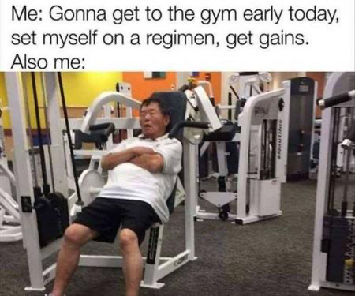
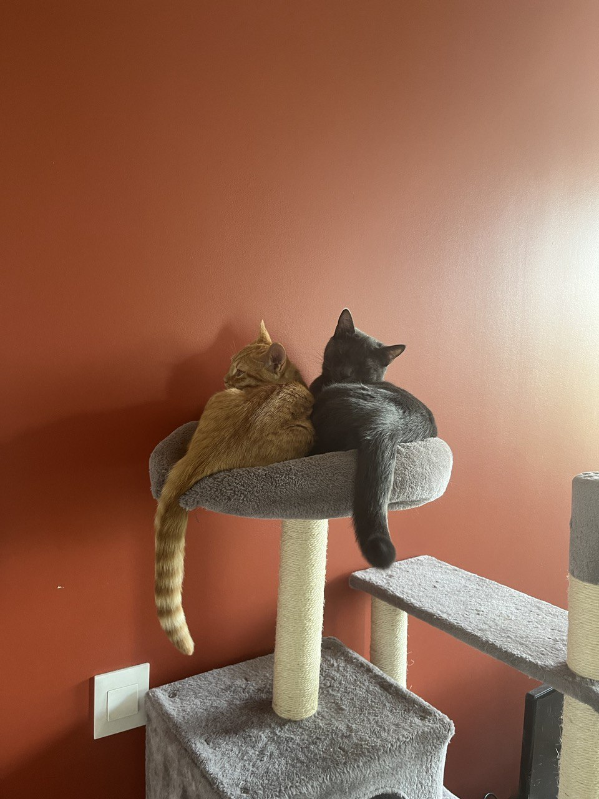

<i>You are young and life is long  and there is time to kill the day  
And then one day you find  
ten years has gone behind  
No one told you when to run  
You missed the starting gun  
</i>
       &emsp;&emsp;&emsp;&emsp;&emsp;&emsp;&emsp;&emsp; - Pink Floyd, <i>Time</i>

2022过得飞快，印象里才刚写完2021的年度总结，2022便也结束了。又是新年的第一天，照旧和过去拜拜。

---

首先应该庆幸的是，读博生活依然在波澜不惊继续着。读博的第二年，与第一年相比表面上最大的区别就是活动变得更多了。疫情过去，虽然我依然申请着居家办公，但总体上每周只在家呆一天，周一到周四都在公司呆着。一般早上十点左右到公司，中午吃个饭，和同事们喝茶聊会，工作到下午三点半，一起下楼打半个小时乒乓球，然后工作到六点下班回家。学校实验室基本不怎么去，差不多算是放弃那边的环境了，我还是比较懒散的，不习惯经常变动环境。

和公司的人也渐渐熟悉了起来，这也多亏了经常在公司露面。这一年里在公司认识了不少新伙伴，又告别了其中的大部分人。但确实很有趣，掐指一算，光在公司里我在的那个小圈子有来自十几个国家的人，而且大部分人都没有什么歧视或者坏心眼，平时聊聊无关痛痒的日常，也算是很开心的事情了。而且因为公司之前来了几个不会说法语的，我们最终在英语和法语之间来回跳转，倒也练了不少英语口语。

一个比较让人开心的事情就是终于有了一篇顶会的文章。虽然中间走了很多弯路，但终究还是成功了一次。只是到现在为止两年过去了，我只有两篇文章，之后的文章也看起来遥遥无期，多少还是有些不满足……

---

事实上现在的作息也算是经过了一番挣扎才养成的。今年暑假期间去和几个伙伴一起去环勃朗峰徒步，调整作息的初衷也是为了不在徒步中过于吃力，同时不拖累平时干活的节奏。最终在徒步后才逐渐养成了现在比较稳定的作息时间，也是人生这么多年以来我相对来说最满意的时间表：早上八点左右起床，八点半去健身房，九点回家，收拾去公司，大概十点到，按公司时间到六点下班，晚上八点吃过饭之后开始做业余项目，直到12点睡觉。通勤来回两个小时都用来看书，如果不去公司或者周末，则是按照通勤时间在家里看书。

当然这并不是完美的作息时间，完美并不存在。比如最大的问题就是晒太阳的时间严重不足，这让我在巴黎漫长且暗无天日的冬天十分煎熬。除此之外，十点到公司开始干活，到十二点吃午饭，中间大概只有一个半小时的实际工作时间，这其实是没有办法做深入思考的。倘若整个时间表再提前半个小时，可能上午的工作会效率提高更多。不过这就得看2023的表现咯。

---

2022的变化很多，其中最明显的就是开始坚持运动了。从五六月开始，每周五到六天会去健身房或去户外跑步，每次持续半个小时到一个小时，一直坚持到年底。最直观的变化是体脂率下降了大概5%左右，到现在的大约14%，而且精神变好了很多。这是目前人生里坚持最长的一次健身，也是效果最明显的一次。如果说有什么遗憾的，那就是体重依然涨不上去。健身前定下的60kg的目标，反而因为锻炼掉了一些脂肪的原因越来越远了，也不知道这算是成功还是失败。

另一个关于作息的问题就是，因为从起床到开始健身中间只有大概半个小时左右，很多时候我都是强忍着惺忪的睡眼和不断的哈欠举铁，效率虽说不是0，但也没有达到理想程度。希望今年可以奇迹诞生，让我健身时候不要再当着健身房一众大肌霸的面犯困。

---

今年的另一个变化是看书开始变多了起来。2021年我定下20本书的目标，失败了，最终只读了19.5本。2022年我大胆了一些，定了25本的目标，结果更失败，只看完了23本。虽然比前一年只多了3本，但是大部头的书多了一些。比如按照页数来算的话，2021年读了4668页，2022年则读了8570页，多了很多，并且其中13本是英文，5本法文，5本中文。

这一年看的这23本书里，最让人印象深刻的只可能有一本：陀思妥耶夫斯基的《卡拉马佐夫兄弟》。这是一本怎么赞誉都不为过的书，我贫乏的语言无法形容，只能说，这是我目前读过最好的书，没有之一。我看的是Ignat Avsey 翻译的英译本，是对照了好几版译本之后选出来的，整个阅读过程很顺畅，非常推荐。

此外，还有一些其他的书我也很喜欢，虽然不及《卡拉马佐夫兄弟》，但也是我非常喜欢的作品：加缪的《第一个人》，阿列克谢耶维奇的《二手时间》，哈耶克的《通往奴役之路》，Eric Hoffer的《The True Believer: Thoughts on the Nature of Mass Movements》。但也有一些让我有些许失望的作品，比如大名鼎鼎的《共产主义宣言》（逻辑混乱但煽动性极强，可能资本论会好一些？），马可·奥勒留的《沉思录》（我并没有从中学到什么新的东西…），茨威格《昨日的世界》（只是前半部分，对各路文化名流的描写与吹捧我是毫无兴趣，但后面好了很多。不过话说回来，我非常喜欢茨威格所谓“世界公民”的理念）。

---

2022也是听歌大收获的一年。2021年听最多的是King Crimson和Pink Floyd，2022年继续了这个趋势，听了更多的经典前卫摇滚乐队，依次是Pink Floyd，Yes，Genesis，除此之外还听了不少Polyphia。Yes的《Close to the Edge》是我的最爱，没有之一，也是第一个能让我喜欢到想要买黑胶唱片机的专辑。遗憾的是，那个年代已经过去了，这种音乐也只有70年代早期才能生产出来吧。

虽然听了这么多前卫摇滚，但是听的次数最多的歌却是Spicy Chocolate的《二人で》，这是日剧《火花》里的小插曲，不知怎么在今年循环了这么多遍。话说回来，看《火花》已经是五六年前了吧，依然没有更喜欢的日剧，真是让人一言难尽呢。

---

今年也试图写了些东西，但是成型的并没有什么，算得上勉强能给人看的只有一个短篇。年中的时候，构思了一个相比以前任何小说都更严肃很多的主题，并且写了两万字左右的第一部分。但终究目标还是比能力高了一大截，最终成品看起来像是被撕成碎片的小说剪影一样。这种感觉就像是难产了两年的《灰梦（二）》，估计还得很久才能重写一遍再拿得出手吧，我觉得。要耐心，耐心。

---

今年还有一些计划上的变化。我们终于决定要试图去加拿大待几年，看看情况。一是因为加拿大枫叶卡尤其好拿，另一方面是那边计算机行业的工资也够高，生活可能会比在法国更轻松一些。佳打算先申博士，现在还在如火如荼筹备中。

我的话，终于把业余项目从写游戏变成写app，这样好上手并且潜在用户足够大。至于具体实施怎么样，我们拭目以待。12月的时候和21年一样，一整个月在家里，想了很多东西，也确定了一些想要试验的东西，希望可以成功。虽说去年定下了要失败两次的小目标，但2022却并没有什么好失败的，因为并没有尝试很多东西。不过2022也足够充实了，其实也不是很失望。

---

2022也是心理上终于开始发生变化的一年。很多以前的执念都放下了，开始大胆朝着理想中的自己走去了。比如终于敢做很多事情，比如表达，比如爱。在看《卡拉马佐夫兄弟》的时候，里面的Father Zosima举过一个例子，大概就是一个人抱怨自己是多么热爱作为虚构的人，但却怎么也对面前真实的人厌恶至极，以至于想要隐居田园。我发现很多人都有这个感受，一边声称自己博爱平等，一边又对流浪汉、乞讨或者任何对他没有用的人恶言相向，找各种借口讨厌对方。当然我也是这样，只是我知道这是愚蠢而且错误的，所以并不会说出来。

2022开始我感觉自己在这方面也终于开了一些窍。这是很细微的直觉反应上的变化，但我还是很开心。能包容博爱的人必须得是独立、自信的人才行，而自卑的人会更多由于恐惧而生出对其他弱者厌恶的负面情绪。希望2023我可以变成一个更好的人。

---

今年发生的事情还有很多，比如给nana找了个小伙伴，nico。nico是我们费了好大劲从安纳西拉回来的小橘猫，佳第一眼看到网上的照片就说，这就是我们家的猫猫！然后固执要买下来，怎么劝也不成。我们只好两个人坐火车去里昂，租车去安纳西，接了猫猫回里昂，然后当天又坐车回巴黎。晚上的时候只感觉做了一天车，天旋地转。

nico的名字也是我起的，佳实在拗不过我。我说这是个多好的名字，听起来就是个阳光大男孩。事实上nico也确实没让我们失望，人见人爱，花见花开，粘人、不记仇、贪玩、喜欢吃，而且有种愣愣的少年感，现在每天他和nana一起跑酷，一起飞檐走壁，身体倍儿棒，连nana的挑食都给治了，这可真是没有想到。

---

想起来2021年的时候对2022的期待，现在回顾一下，似乎这种期待变得越来越强烈了。30将至，要变成自己以前心目中无聊的大人的年纪了，我也确确实实觉得自己在朝着无聊的路上飞奔，这可不行，无聊太可怕，所以我对2023的期望是多做一些有意思的事情，好在以后某年回顾23年的时候可以开心地想到，你看，虽然老了一些，但也过得挺充实的嘛。

当然，也希望2023我可以更年轻。