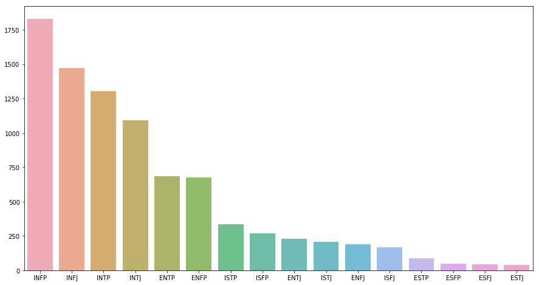
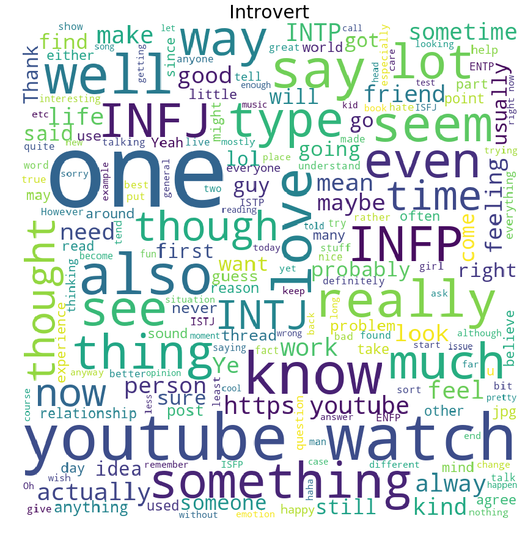
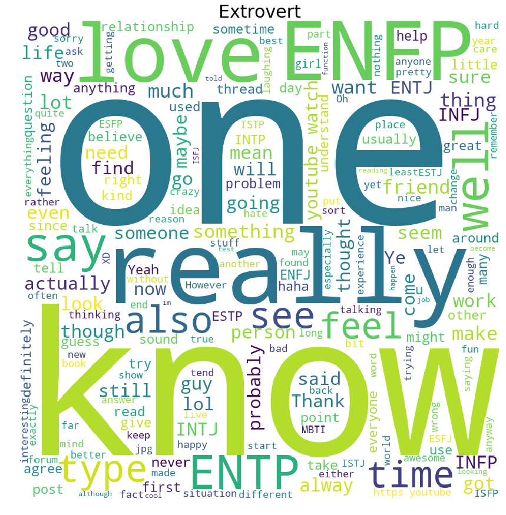

*Kaggle is a great place to search for some interesting datasets. And this time, I found a dataset called [(MBTI) Myers-Briggs Personality Type Dataset ](#1), which contains 8600 MBTI types from different people and their posts. Based on several analyses posted on Kaggle, I used this dataset to train a modal of personality prediction. At last, personalities of several charaters in the series Bojack Horseman are predicted. According to [Wikipedia](https://www.wikiwand.com/en/Myers%E2%80%93Briggs_Type_Indicator), although it is popular in the business sector, the MBTI exhibits significant psychometric deficiencies, for example poor validity, poor reliability and not being comprehensive. As a result, this exercise will be done just for fun, without any solid theoretical basis on psychological preferences.*      


# 1. MBTI Modal

According to the introduction of the wikipedia,The MBTI was constructed by Katharine Cook Briggs and her daughter Isabel Briggs Myers. It is based on the conceptual theory proposed by Carl Jung. "The underlying assumption of the MBTI is that we all have specific preferences in the way we construe our experiences, and these preferences underlie our interests, needs, values, and motivation."      

>## Four dichotomies
 >The MBTI sorts some of the psychological differences into four opposite pairs, or "dichotomies", with a resulting 16 possible psychological types. The 16 types are typically referred to by an abbreviation of four letters—the initial letters of each of their four type preferences (except in the case of intuition, which uses the abbreviation "N" to distinguish it from introversion):      

 >Attitudes: **e**xtroversion/**i**ntroversion   
 >Functions: **s**ensing/i**n**tuition and **t**hinking/**f**eeling   
 >Lifestyle preferences: **j**udging/**p**erception       

>The terms used for each dichotomy have specific technical meanings relating to the MBTI, which differ from their everyday usage. For example, people who prefer judgment over perception are not necessarily more "judgmental" or less "perceptive", nor does the MBTI instrument measure aptitude; it simply indicates for one preference over another. Someone reporting a high score for extraversion over introversion cannot be correctly described as more extraverted: they simply have a clear preference.     

# 2. Dataset Analysis

As the dataset I've got from Kaggle have already been marked, we can firstly take a look at the distribution of different personality types. The result is as follows:     
      

From this graph we know that the dataset is not balanced at all, there are more people who are 'I','N' and 'P' than those who are 'E', 'S' and 'J'. This can cause trouble during the process of the dataset. Thus some extra processes may be necessary[[2]](#2).     

Now let's look at the characteristic of different personality types. To simplify, I will just show the difference between the Introvert and the Extrovert. To generate a wordcould, it's quite easy when you use the python package: wordcloud. Easy to install and easy to use. Before we start to generate the wordcloud, it's necessary to eliminate some most common words which we call stop words. Except for these commom stop words, we also need to filter out some words which are mentioned frequently in both cases such as 'think', 'people' and 'thing'. The code is shown below:     

```python

# Data Aggregate
import numpy as np
import pandas as pd
import sklearn

data = pd.read_csv('mbti.csv')
type_quote = data.groupby('type').sum()
e_posts = ''
i_posts = ''
for _type in type_quote.index:
    if 'E' in _type:
        e_posts += type_quote.loc[_type].posts
    else:
        i_posts += type_quote.loc[_type].posts

# Generate wordcloud
from wordcloud import WordCloud, STOPWORDS

stopwords = set(STOPWORDS)
stopwords.add("think")
stopwords.add("people")
stopwords.add("thing")
my_wordcloud = WordCloud(width=800, height=800, stopwords=stopwords, background_color='white')
# Introvert
my_wordcloud_i = my_wordcloud.generate(i_posts)
plt.subplots(figsize = (15,15))
plt.imshow(my_wordcloud_infj)
plt.axis("off")
plt.title('Introvert', fontsize = 30)
plt.show()
#Extrovert
my_wordcloud_e = my_wordcloud.generate(e_posts)
plt.subplots(figsize = (15,15))
plt.imshow(my_wordcloud_infj)
plt.axis("off")
plt.title('Extrovert', fontsize = 30)
plt.show()
```

Then the wordcloud of Introvert and Extrovert are generated as follows using this method.       
    
    

Well, it's quite intreseting to see that big 'watch' and 'youtube' in the wordcloud of the Introvert. Meanwhile the 'really', 'know', 'love' are much bigger than those of Introvert, meaning that they use these words much more frequently.    

# 3. Text Vectorization and Modal Training
Having a basic understanding of the dataset, we can now train the modal of MBTI prediction based on the text. But firstly, some methods of text vectorization need to be introduiced.    

## 3.1 Text Vectorization   
### 3.1.1 The Bag of Words  

The Bag of Words Representation is a general process of converting a text document into numerical features. The process of converting documents into vectors is called text vectorization. By representing every word as a integer and counting the frequency of appearence, a document can be marked as a vector.For most of the documents, only a subset of the dictionary could be used, thus the matrix of text vectorization would mostly be like sparse matrix.    

### 3.1.2 CountVectorizer

CountVectorizer is a text vectorization fonction in the package sklearn, and also a most basic one. The value of the vector correspond to the frequency of the word. Many parameters can be ajusted, while in our case we can just take them as default values. The example of usage is as follows:     

```python
from sklearn.feature_extraction.text import CountVectorizer
vectorizer = CountVectorizer(min_df=1)

corpus = [
     'This is the first document.',
     'This is the second second document.',
     'And the third one.',
     'Is this the first document?',
 ]
X = vectorizer.fit_transform(corpus)
X                              

<4x9 sparse matrix of type '<... 'numpy.int64'>'
    with 19 stored elements in Compressed Sparse Column format>
X.toarray()
array([[0, 1, 1, 1, 0, 0, 1, 0, 1],
       [0, 1, 0, 1, 0, 2, 1, 0, 1],
       [1, 0, 0, 0, 1, 0, 1, 1, 0],
       [0, 1, 1, 1, 0, 0, 1, 0, 1]]...)
```

### 3.1.3 Tf-idf

In some documents, there are certain words which are quite frequently appearing thus they rarely have useful information on the actual content of the document. If we put all these words into classifier, these frequently appearing words would possibly mask the words rarely-presented yet more meaningful. So as to recalculate the weights of each word, usually, tf-idf transformation would be processed. Tf stands for term-frequency and tf-idf represent the result that term-frequency times inverse document-frequency, which is:     
$${\displaystyle \mathrm {tfidf} (t,d,D)=\mathrm {tf} (t,d)\cdot \mathrm {idf} (t,D)}$$     
Because of the lack of information of the frequently appearing words, this method effectively enhances the matrix representation of documents. However we also need to know that this mothod is not necessarily superior to the traditional CountVectorizer. In sklearn, CountVectorizer and TfidfTransformer can be found in the same module.     

```python
from sklearn.feature_extraction.text import TfidfVectorizer
vectorizer = TfidfVectorizer(min_df=1)
vectorizer.fit_transform(corpus)
...                                
<4x9 sparse matrix of type '<... 'numpy.float64'>'
    with 19 stored elements in Compressed Sparse Row format>
```


## 3.2 Comparison


In this dataset, I found that countVectorizer even has better performance than Tf-idf(which is also proved by several kernels in Kaggle). I also found some discussion about the influence of the frequently appearing words[[3]](#3). Then, different machine learning modals are used(Logistic Regression, Naive Bayes, Multilayer Perceptron, Extra-trees Classifier and Random Forest). Among which the code for logistic regression is shown below:    


```python
from sklearn import ensemble
from sklearn import feature_extraction
from sklearn import decomposition
from sklearn import pipeline
from sklearn.model_selection import StratifiedKFold
from sklearn.model_selection import cross_validate


kfolds = StratifiedKFold(n_splits=5, shuffle=True, random_state=1)
etc = ensemble.ExtraTreesClassifier(n_estimators = 20, max_depth=4, n_jobs = -1)
countV = feature_extraction.text.CountVectorizer(ngram_range=(1, 1), stop_words='english', lowercase = True,  max_features = 5000)
scoring = { 'neg_log_loss': 'neg_log_loss', 'f1_micro': 'f1_micro'}

# Logistic Regression
from sklearn.linear_model import LogisticRegression
model_lr = pipeline.Pipeline([('tfidf1', countV), ('lr', LogisticRegression(class_weight="balanced", C=0.005))])

results_lr = cross_validate(model_lr, data['posts'], data['type'], cv=kfolds, 
                          scoring=scoring, n_jobs=-1)

print("CV F1: {:0.4f} (+/- {:0.4f})".format(np.mean(results_lr['test_f1_micro']), np.std(results_lr['test_f1_micro'])))

print("CV Logloss: {:0.4f} (+/- {:0.4f})".format(np.mean(-1*results_lr['test_neg_log_loss']), np.std(-1*results_lr['test_neg_log_loss'])))

```


Other modals are similar to the code above, all we need to do is modify the corresponding part. The best modals are Logistic Regression, Naive Bayes and Multilayer Perceptron, which would gave a f1 socre about 0.65 - 0.67. The others, such as Random Forest and ExtraTree, wouldn't even make it to 0.4. The generally lower scores of the results may be due to the fact that the data of some characters is too small (the amount of data is not balanced). However, if undersampling before the learning is processed, a lot of data would be reduced, thus the accuracy will also drop a lot.     


# 4. Personality Predictions of BoJack Horseman

I searched from the Internet and found two scripts of the series Bojack Horseman(the first two episodes). Then, I passed the data of Bojack, Todd, Diane, Mr. Peanutbutter and Princess Carolyn into the  Logistic Regression modal, then I have the result as follows:     


| Caracter  | BoJack    | Todd  | Diane | Mr. Peanutbutter  | Princess Carolyn  |
| ---       | ---       | ---   | ---   | ---               | ---               |
| MBTI type | INTJ      | ESFP  | INTP  | ISTP              | ENTP              |


At first glance, except for Mr. Peanutbutter, the others seems good for me. Just to find what the others think about the characters, I looked up in Reddit for a while, and I found that people don't really have a common opinion on this. There are indded some opinions consistent with my prediction. Considering that the f1 score is only 0.67, I think it's a quite good prediction.   


*Reference Materials*
1.  <span id="1"></span> https://www.kaggle.com/lbronchal/what-s-the-personality-of-kaggle-users/notebook
2.  <span id="2"></span> https://machinelearningmastery.com/tactics-to-combat-imbalanced-classes-in-your-machine-learning-dataset/
3.  <span id="3"></span> https://datascience.stackexchange.com/questions/12607/tf-idf-vectorizer-doesnt-work-better-than-countvectorizer
4.  <span id="4"></span> https://www.reddit.com/r/mbti/comments/4xfbv0/bojack_horseman_character_types/