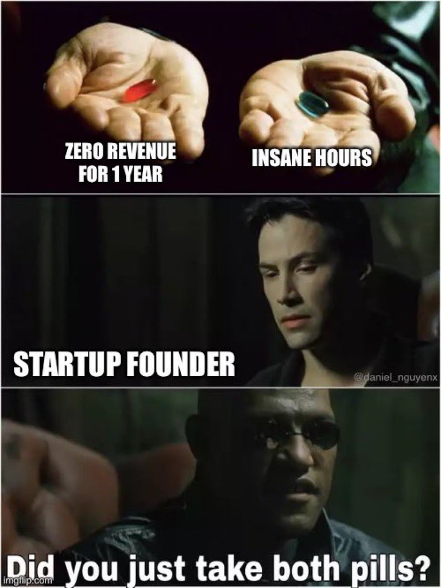
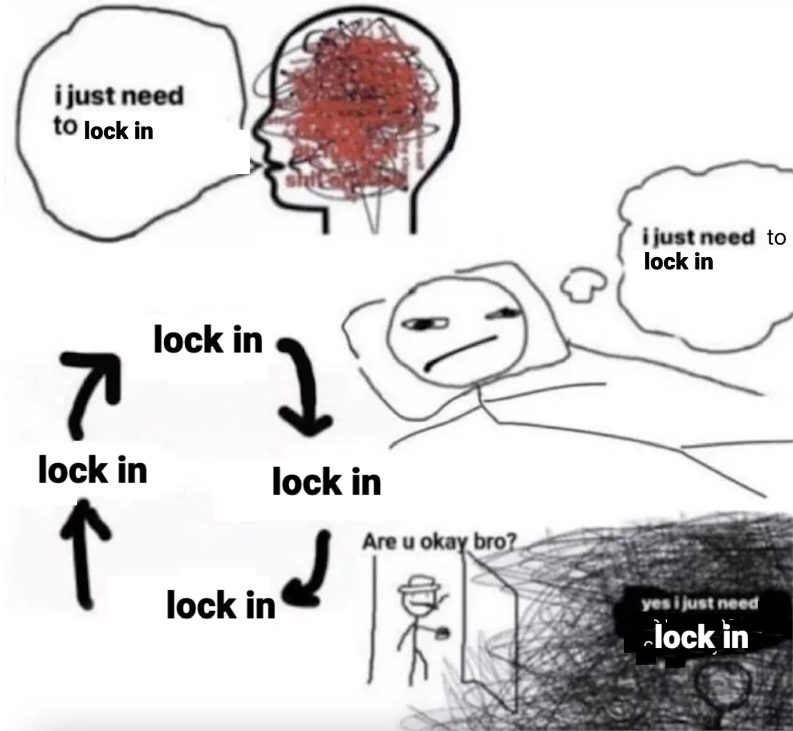
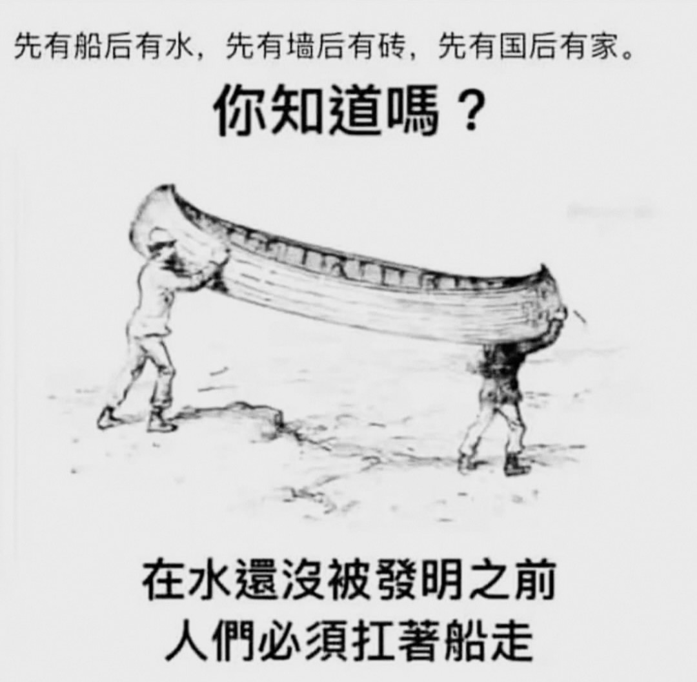
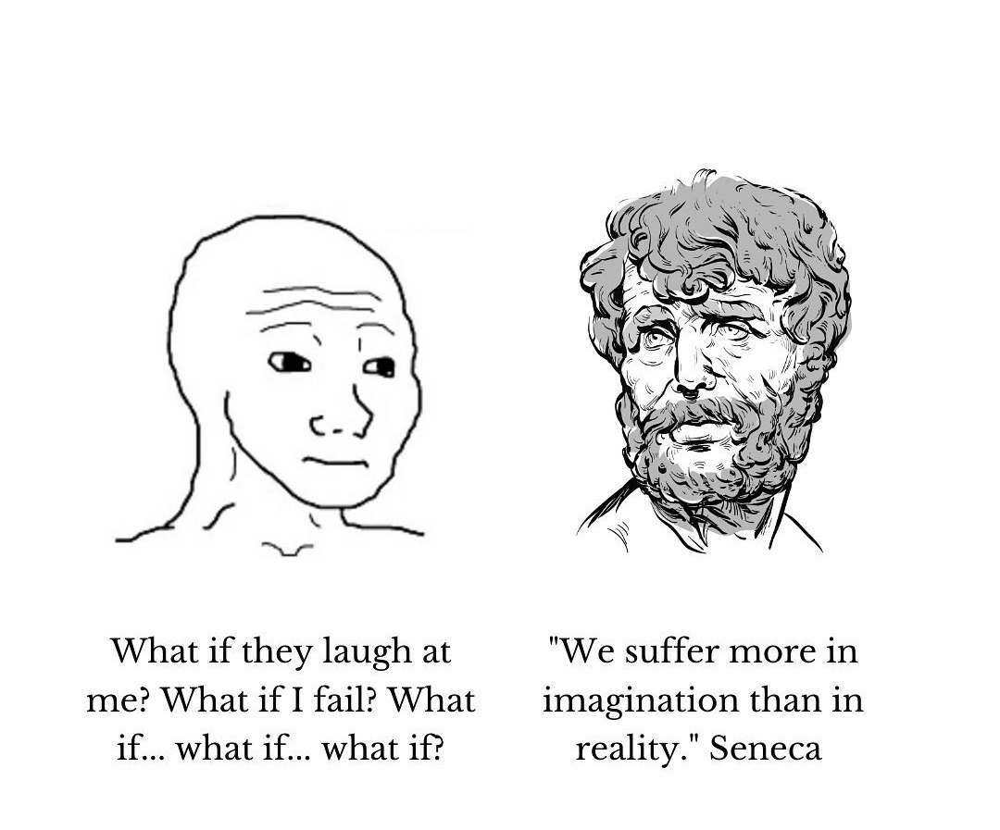
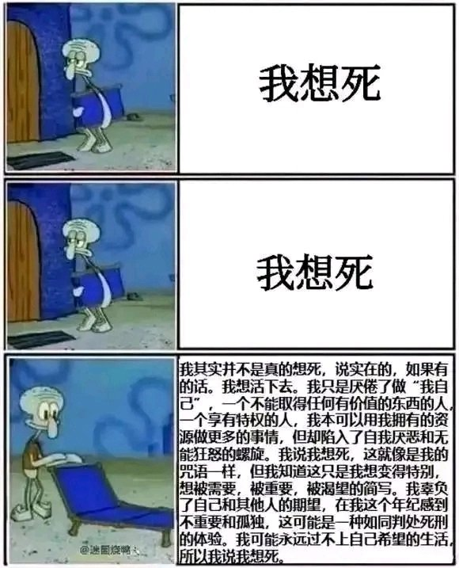
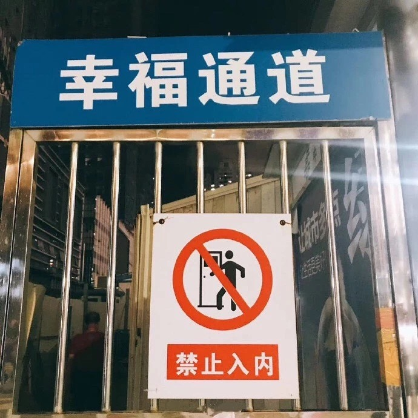
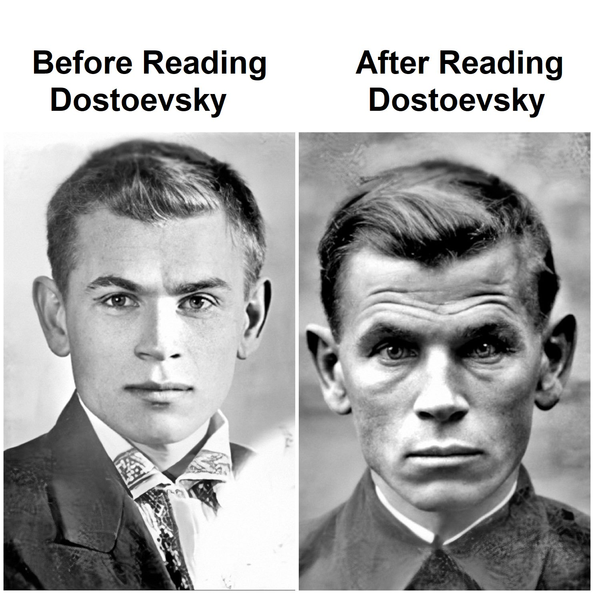
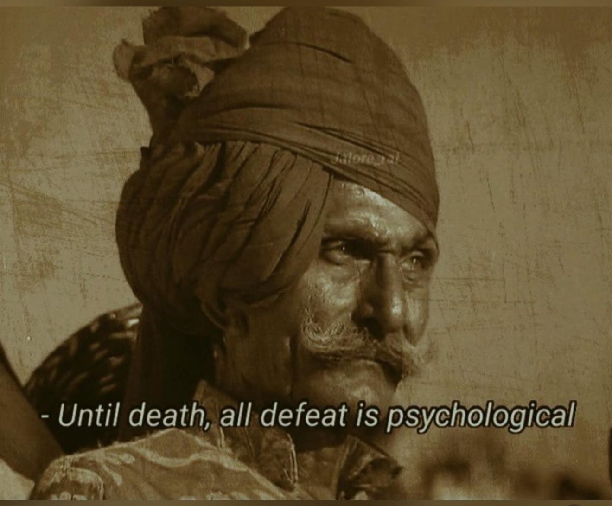

转眼就2025了，果然成年人的时间跑起来的话，是比博尔特的加速还要快呢。

<i>光阴似箭，说不定再一眨眼就死到临头了呢 </i>

---

24年的话，比起23年来说，平静了很多。一整年都在13区这个16平米的小房间里窝着，就像一个真正的宅男一样。累的时候看看书，看看动画片。听了很多歌，也写了不少代码。一整年都没怎么社交过，几乎一直都只是和自己的大脑在一起。

但是这样的清净生活，让我想明白也接受了许多事情。所以说今年的年终总结，很可能会比之前的要沉重很多。而且另一方面，今年的主题是：精神健康。

---

还记得年初的时候，我踌躇满志，相信自己一定能干出一番大事业，赶在暑假的时候就可以养活自己，年底财务自由，明年就可以扩张业务变身巴黎首富了。结果现在已经25年第一个月快要过去了，这一年算下来，用我的创业计划只赚到了大概100欧左右。虽说并不是颗粒无收，但是比起来之前的宏大计划来说，几乎是毁灭性的打击了。

<i>在失败的路上，我不是一个人 </i>

这也奠定了这一年的基调：沉寂和失败。

心里总是惦记着，网站这个地方没有做好，那个地方还需要加内容，这种紧迫感让人很难休息或者放松下来。在有其他人或者是有强制性的规律生活的情况下，这倒也不是什么问题：毕竟在以前，出门坐车，走路去公司，和同事打招呼，给不同的朋友吐槽啊工作好难啊，这种微不足道的小事情，就会排解掉很多压力了。但是我这样在小房间里，脑子里时刻堆满着待办事项，看不到未来也看不到终点。在这种希望随时都可能破灭的状态，是根本顾不上保护自己的精神健康的。社交和放松是什么东西，在很多时候已经完全忘掉了。

<i>可能我还不是真正能干的家伙 </i>

所以一直在这种高压状态下，我有时候就会进入到开悟的状态。这倒是人生第一次有这种体验：能意识到并且接受我自己行为的局限性，过去的已经过去，未来有无限可能，但是无论如何都无所谓。因为不必为未来或者当下操心，就会心情前所未有的轻松，然后就会很开心做一切事情，连铲猫砂都变得快乐起来。

但是可惜的是，这种状态从未持续超过一天。不过最近却是出现的越来越频繁了。也不知道我这是即将掌握
宇宙生命和一切的真理了，还是在逐渐疯掉。难说。

---

今年尤其体会深刻的，是理论和现实的差距。

去年这个时候，我满脑子鸡汤，每天就像疯了一样在家里喊着“[live life hard](https://www.youtube.com/watch?v=312Sb-2PovA)”，然后去锻炼，去写代码，兴奋得像刚放暑假的小学生一样。那种突然有了自己想做的项目的自由还有遥远的希望的时候，是最开心的。按部就班干活，每天进步一点，总感觉财务自由就在眼前。看着推特上的大佬们谈笑风生，感觉自己也马上是其中一员了。他们谈论的想法、理念，我都理解；常人会有的误区以及背后的原因，我也觉得自己完全掌握了。就像是吸收了全世界最宝贵的知识一样，我信心满满突击了好几个月。

<i>yes yes lock in... </i>

结果慢慢发现，现实并不是那样的——我无法长期高强度地专注于单一项目。如果白天长时间进入“[心流](https://zh.wikipedia.org/zh-cn/%E5%BF%83%E6%B5%81%E7%90%86%E8%AB%96)”状态，晚上必然会失眠，第二天感觉就会异常糟糕。如果白天加入其他活动，例如锻炼，看书，就会让我很难进入完全专注的状态，工作效率又会大打折扣。可以说，这一年来我和自己的斗争，就是寻找劳逸结合平衡——在保持精神稳定的前提下，最大化生产力——的过程。

所以说，即使专门为解释并且解决现实问题所创造出来的理论，也并不能完全保证管用。虽说我已经比以前进步了不少，但还是不够弥补我作为普通人和大佬之间的差距。这并不是说这事情有多么困难：有些天赋选手可以容易掌握的事情，对于其他人来说可能难于登天。我的话，很显然就是在创业时最愚钝的那种家伙：自以为掌握了一切知识，却无法将知识实践的那种人。

最终的智慧都是以最简单的形式存在的，而那些成功的秘诀也没有被隐瞒的必要——毕竟大部分人，即使知道了该怎么做，也是无法做到的。以前会偶尔听到人说，那些已经成功的人怎么可能真的教你怎么做呢。现在看来确实无所谓：即使奥运冠军给全世界公开自己是怎么训练的，也不会有普通人会因此而突飞猛进威胁到他的地位。但是如果有普通人真的坚持下去成功登顶，他也不再是以前的自己了。

---

所以这样更发觉以前的我（其实也只是两年前吧）真是很天真，以为一切都可以讲道理，一切都可以用理论来解释。现在才发现，理论家们凭空发明出来的理论，只是在理论层面上更擅长罢了。而那些从实际经验中**总结**出来的理论，才真正具有实用价值。这也解释了许多复杂现实问题的根源：为什么共产主义的实现总是伴随着饥荒和独裁，为什么没有歧视或战争的世界总是那么遥远，为什么真相总是会被偏见或谣言掩盖。

因为这个世界不讲道理。

这就让我觉得许多工作其实没有意义。很多人在大学或研究所里做着希望可以改变全世界的研究，最终对现实上的贡献，可能还没有外卖小哥多。但是从另一方面说，学术研究对现实的贡献，也是以概率的形式产生的。大多数人对理论的缝缝补补，只是为了等未来某一个突破性的发展后，才能把它应用到实际上。问题是我们并不知道哪个研究是毫无意义凑数的，哪个是真正会推进社会发展的。

正因为无法预知，我们才需要更多人参与进来。通过扩大研究群体，才能加快理论转化为实践的过程。一些本来就基于解决很具体的现实问题的理论，就更容易应用到现实；一些基于对未来“应该发生”的事情的期待，而创造出来以改变现实的理论（比如马克思理论，比如乌托邦，比如很多女权研究），就更难应用到实践中。

这也是为什么科学技术发展会比哲学思想发展更迅速：因为大部分科技诞生都是为了解决已经存在的问题。而哲学思想，一些时候是为了解决大部分人都没有的问题，另一些时候则是为了解决凭空创造出来的问题（例如性别对立，无产阶级联合，等等）：这时候它就更难解决它原本希望解决的问题，只是造成现实的混乱。这就造成了这类理论研究走向不同的极端：要么走向民粹变疯，要么形成小圈子自我封闭，脱离现实。

<i>从一个错误的前提推导出来的结论，能有什么问题呢？ </i>

所以如果只是说“理论上来说”的话，这后面可以跟任何句子，任何理论，任何思想。只要可以自圆其说，理论就是对的。而且更可怕的是，任何理论，只要同意的人足够多，它就可能被认为是正确的。不论是对犹太人的屠杀，还是大跃进，还是现在正流行（也可能正在消亡）的[wokeness](https://paulgraham.com/woke.html)——尽管他们立场、恶劣程度、影响力各有不同。

这应该也是今年我想法上相比过去最大的变化了。以前的我总是从理论出发，会觉得人总是会讲理的，只要我用5岁小孩都能听懂的语言，就一定可以和其他人达成共识。现在发现，这个世界不讲理，大部分人也是不讲理的。理论上再成熟，和现实也是不一样的。尽信书不如无书，大概就是这样了。

---

其实只要意识到以上的内容，就很容易理解很多现实中看似很不符合逻辑的地方：为什么有些很聪明的人会做出一些很傻的事情，为什么一些看似荒谬的论点会在理应很严肃的场合光明正大地出现，为什么大家都在说的“世界是个巨大的草台班子”是真的，以及为什么这一些都不重要。

因为这个世界不讲道理，所以人们往往会选择最有用的办法，而不是最正确的办法来解决问题。这个逻辑，只需要举个例子，就很清楚了。

例如在几年前有人（特指扎克伯格）炒作元宇宙，直到最后项目失败，不得不把囤积的GPU转用于AI模型训练；在这几年有人（很多投机分子）炒作区块链和虚拟货币，虽说有人借此财务自由，但也有不少人家破人亡。这些技术的共同点是：解决的是当下并不需要解决的问题，或者是凭空创造出来的问题。但是反观这次的AI大模型，不只在各个领域提高了生产力，还在更广泛的场景下带着人类走向新的时代。如果我们关注科技公司对这几个项目的投入，也能明显看出来，只有AI是他们真的在乎的项目。

从理智的角度上来看，这几个同样“火”起来的技术，其实值得投资和关注的只有一个：那就是可以真正提高生产力，可以变革生产方式的AI。但却有很多看似很聪明的人对其他很明显没有前景的项目奉献大量的精力，为什么呢？因为这样对他们“有用”。

明知项目毫无前景，为什么还要鼓动大家投资呢？因为他们能从中牟利。他们不在乎技术或发展，他们只在乎钱。

这也是为什么当国家出台了很愚蠢的政策，却不会有官员去质疑，反倒有很多专家尝试解释为什么这是所谓的“一盘大棋”：因为他们不需要好的政策，他们需要有利可图。

这也是为什么川普，一个精明又伶牙俐齿的商人，会经常用极慢又有个人特色的语调说出让人觉得他头脑有问题的言论：因为这样可以使人印象深刻，可以达到拉拢选民的目的。

这也是为什么比尔盖茨口口声声说要环保，却做空了特斯拉：因为比尔盖茨更在乎自己的投资收益。

这也是为什么很多企业这几年会突然在乎性别平等，在乎少数族裔，在乎性少数群体：因为这样可以更好塑造企业形象，创造更多收益。

这也是为什么一些我喜欢的乐队，在作出爆裂的专辑后，装作天真烂漫去做口水歌：因为这样更容易火，更容易被市场接受。

如果只看表面，就会感觉被骗到：原来世界真的是个草台班子！这是因为大家都关注点都在错误的地方：人们都会挑有用的办法解决问题。如果对于聪明人来说，装作不那么聪明可以解决问题的话，他会让所有人都觉得自己是个人畜无害的小傻子。

---

关于我想法的另一个变化是，很多东西变得无所谓了，心态大部分时候是 “是什么就是什么”（it is what it is）。这并不是说像有些人理解的斯多葛主义（Stoicism）一样，无视情绪。而是提高对负面情绪的抵抗能力，在大部分时候保持平常心，以一个旁观者的角度，理解并接受有些事情就是会超出自己的控制范围。如果是好事，那当然值得开心，但是如果是坏事，也无所谓。

<i>it is what it is </i>

感觉上来说，最大的好处是对负面情绪的抵抗能力变强大了很多。而原因的话，主要是认识并且接受了两点：
1. 分清楚自己可控制的，还有自己不可以控制的。
2. 对自己不可控制的事情产生负面情绪是没有意义的。

这两点说起来简单，但是实际上很难达到。

例如第一点，很多人，包括我自己，都会错把很多不可以控制的事情当作可以控制的，然后用错误的方式控制，导致失败的结果，然后为此生气。一些很典型的几乎不可控制但是人们经常会觉得可以控制的事情有：其他人（稍微大一些的成年人）的三观，其他人的人生选择，科技的发展，人性（贪婪、懒惰等等），女朋友已经决定好吃什么晚饭但是礼貌性询问你的意见。

这样的好处，最大的就是心情的平静：有些东西是没有办法，也没有必要的，那为什么要那么严肃地去生气或者难过呢？乐观一点的话，不只是自己的情绪，各种事情也会变得顺利起来。

<i>担忧是没有必要的（那些有必要的担忧除外） </i>

---

所以，今年另一个很大的变化是发现乐观的价值。不知道哪位智者（应该是Thomas Friedman）说过："Pessimists are usually right and optimists are usually wrong but all the great changes have been accomplished by optimists.（悲观主义者通常是对的，乐观主义者通常是错的，但所有伟大的变革都是由乐观主义者完成的。）"

想到以前的我总是悲观又愤世嫉俗的感觉，甚至连小学时候，我给自己起的第一个网名都叫做“问世不语”。每当看到乐观的人的时候，总会有一种“他好傻”的感觉。回头看来，虽然以前的我说的都对，但同时也是没用的。这种悲观的思想耽误了很多我本身可以做得更好的事情。

<i>不…… </i>

第一次意识到人在有些时候需要“盲目乐观”的时候，是很多年前看《指环王》时，希优顿国王和阿拉贡在圣盔谷之战前的对话。希优顿国王和阿拉贡在城墙巡逻的时候，阿拉贡并不赞同希优顿国王给人们所说的“庄稼可以再种，房屋可以再建，只要我们守在这个地方，我们就可以耗过他们”。因为，这确实是“很傻”的说法。

> 阿拉贡：他们不是来毁坏洛汗的庄稼或者村庄，他们是来消灭人类的，连孩子也不会放过。
> 希优顿国王（小声）：那你想我怎么样？看看我的子民们，他们都很恐惧。如果我们要命绝于此，我宁愿他们壮烈牺牲，让世人永远铭记。

这是我第一次真的发现，乐观在有些时候比正确要更重要。但是真的让我深刻体会到这个的重要性，还是今年。因为一个人在家里闷头坐着一个几乎注定要失败的项目，精神危机是必不可免的。在这一年和自己情绪的战斗里，我可以坚持不情绪崩溃的时间变得越来越久，而且对乐观重要性的感受也更深。到后来我会刻意想办法让自己乐观起来，这也是今年一个很有意思的转变。

所以暂时的结论是，乐观是在很多困难时候最重要的习惯，即使这种乐观是盲目的。重要的是：你是想要正确，还是想要改变现实，强迫这个世界（或者自己）变得正确。

---

关于精神问题就到这里吧，毕竟还有很多更现实的东西需要总结。其中很重要的一点就是，感受到了人类创造历史的速度和时代的剧变。不知道是我逐步增长的年龄让我更敏感了，还是这个时代确实在加速发展，或是两者都有。

无论文化还是科技，发展速度都前所未有。从音乐、影视、动画到体育，从一直在爆发的自媒体到几个月就翻天覆地的AI，再到能源、航天，这种发展速度已经超出了“快速”可以形容的范畴。这让我感觉自己身处人类历史最重大的变革之中，但是却手足无措，不知道自己该做什么反应。

<i>崭新万物正上升幻灭如明星 
我却乌云遮目 
 
</i>
       &emsp;&emsp;&emsp;&emsp;&emsp;&emsp;&emsp;&emsp; - 万能青年旅店, <i>采石</i>

其实我是知道自己该怎么做的，但却怎么也跟不上发展的节奏。努力想要成为走在最前面的人，却因为自己体力不支而跟不上，只能看着别人越走越远，确实是有一种自己可真是不争气的遗憾。

人最大的敌人，永远都是自己。

---

其次是关于国内的发展。虽然所有人都知道大环境不好，经济日趋衰弱，但偶尔还是有一些让人惊讶的“奇迹”在。比如游戏（米哈游依然很火，黑神话悟空也很让人惊艳，还有很多其他即将发布的备受关注的游戏，比如昭和米国物语，比如影之刃零），比如AI大模型（deepseek等）。类似的爆发让人感觉中国在国际上的崛起终于要开始了。

但是，这种蓬勃的发展和经济上的萎靡怎么看也不是应该同时出现的事情。这也让我想到之前看过的一个关于对人审美的理论：每个年代的审美都会和经济状况相关，但滞后一段时间。倘若经济不好，人们温饱难以保障，持续一段时间后，审美会逐渐趋向于脂肪更多的“圆脸”。但如果经济突然腾飞，人不再为吃饱饭而发愁，这种经济变化引起的审美变化（以瘦为美）只会在十几年后，甚至二三十年后才兴盛起来。这也是为什么长辈都喜欢圆圆胖胖的，而当代年轻人总是在减肥。

我想大概文化、科技的发展也有这种滞后性。从小便可以接触国外文化，接触最新科技的我们这一辈人，等到现在二三十岁的时候，便可以把从小学到的这种思维和想法实践出来，从而做出一些和当下经济发展趋势完全相反的成果。这种滞后性让很多人觉得现在的中国很有发展前景，因为毕竟我们*现在*做出来了这么好的“产品”。这也让我关注的很多国外的大佬们对中国尤其向往。

只是可惜，他们向往的其实是按照改革开放一直走下去，没有政治变动的繁荣昌盛的中国。实际上的中国，已经在十多年前，被一个人永远地改变了。这种改变，可能也需要二三十年才能完全反映出来。现在的繁荣，其实是历史的倒影。

<i>立入禁止 </i>

虽然知道这种繁荣不会持续太久，也总比没有繁荣过要好很多。

---

可能是因为在家呆太久，然后出门社交都是零零碎碎的点缀在一年之间，导致我经常想不起来我在什么时候和什么人做过什么事情。有时候猛地想起什么事，却不知道这是在梦中发生的，还是今年，还是很久之前发生过的。可能这种枯燥的生活也让记忆变得模糊不清？

加缪曾曰：“J'ai compris alors qu'un homme qui n'aurait vécu qu'un seul jour pourrait sans peine vivre cent ans dans une prison. Il aurait assez de souvenirs pour ne pas s'ennuyer. (我意识到，一个只活过一天的人完全可以轻松地在监狱里活上一百年。他会有足够的回忆，不至于感到无聊。)”

我并不觉得这是真理，但是我现在确实会有各种乱七八糟的回忆在不经意的时候突然蹦出来，吓我一大跳。我会给自己说，原来曾经我还经历过这种事情，原来我曾经是那个样子的，原来事情竟然变化了那么多。

有时候突然想起来，仅仅在几年前，我最大的目标还只是：不讨厌自己。这么看的话，我确实变化了挺多。

不知道等到老了之后，我的回忆还会用什么方式来惊吓我。

<i>经常会忘了以前的生活到底是什么样的 </i>

---

说是一直在家，但其实很多时候是在咖啡馆的。在24年前几个月的时候，我每天下午都会走半个多小时去Austerlitz附近的Pret A Manger。那家环境很好，平时也没有几个人，所以每天都很安静。Pret A Manger的歌单也不错，偶尔也会听到Mazzy Star或者其他乐队的歌。我总是会记得我带着耳机，听着yoasobi的《祝福》，迈着快步朝着咖啡馆疾奔的路上。就像我总记得23年，听着Jethro Tull的Thick as a Brick，在Châtillon-Montrouge地铁站随着人群下车的景象。

后来五月初的时候爆发了一次很严重的抑郁，有一周时间几乎起床都困难，其后一周时间也只是勉强可以坐在桌子上的程度。之后就再也没有怎么去过那家Pret A Manger了——主要是有些远。之后的Pret A Manger主要就转移到国图的那家，和意大利广场那家了。这样的话，走路十来分钟就可以到，关于路上暴走的记忆，就没有那么清晰了。

等到11月的时候，Pret A Manger说他们的套餐即将到期，我也就失去了去咖啡馆的动力了。所以也很少去咖啡馆干活了。不过还好，现在已经几乎不需要去咖啡馆就可以维持精神稳定了。这也可以算作是今年的进步。

---

因为一直一个人，所以听了很多歌。几乎只要不是睡觉，或者是在看视频的时候，都在听着歌。根据spotify的统计，我去年听了125723分钟的音乐，平均算下来，每天大概是6个小时。这还不包括我在youtube上的听歌时间。

今年听歌主要是两大部分。一部分延续了之前两年前卫摇滚的趋势，新听到了很多很不错的乐队。我花了很长时间听Tool, Opeth, 和Haken。Tool是早有耳闻（因为有很多烦人的狂热粉丝而出名），但却一直没听进去过。结果今年发现，Tool是在情绪上很“中性”的乐队，很适合在写代码狂热的时候当背景音乐，平时听也会让我感觉可以更容易进入平静状态的错觉。而且今年也听了很多King Crimson早期的其他专辑：In the Wake of Poseidon, Lizard,  Larks' Tongues in Aspic等等。这下算来，King Crimson在八十年代之前的专辑总算是全部听完了。

听歌另一部分则是属于日本的。不只听了不少JPOP（yoasobi, yorushika, いきものがかり，以及其他），还有很多日本的金属乐：Maximum the Hormone，花冷え， Unlucky Morpheus，妖精帝國，等等。其中每个乐队都听了很久，尤其是Maximum the Hormone和妖精帝國。与此同时，花冷え是去年最让我大开眼界的乐队，风格上无与伦比，就像是Babymetal的金属升级版一样，唯一的缺点可能就是专辑数量太少吧……她们的第二张专辑《来世は偉人！》也让我经常思考，这辈子，我大概是做不了伟人了吧。

想了想，竟然还是有些惆怅。

---

这一年没怎么看书，倒是看了很多动画。

主要原因是看书的话，我更喜欢看严肃一点的书，需要精神上更投入一些。但是看动画的话，我自然而然对它期望就很低：就像我对待前卫摇滚和流行乐的态度差异一样。结果从听歌时间上来看，反倒是听稍微轻松或者流行的东西时间更久一些。

很尴尬，去年一共就看了4本书，其中有一本是《罪与罚》。后遗症便是，我时刻怀疑我自己是不是其中的主角面临的困境：以为下狠心走出第一步就可以成为想要变成的那种人，结果却自己的精神承受能力远远不够而放弃，最后走一大截弯路。这种想法在有时抑制不住的悲观时候会尤其突出。

<i>但还是…… </i>

因此我这么安慰自己：不尝试便不会知道到底行不行。"Mieux vaut des remords que des regrets (悔恨胜于遗憾)"。尝试之后的失败，一般来说总是比不尝试的后悔要强。当然例外是，如果你可以很好欺骗自己，吃不到葡萄就说葡萄酸，这倒是另一回事了。

动画的话，果真是看了不少。大部分是在吃饭时候，伴着饭吃下去的。不过也是很好的放松精神的材料。有一些好看的：《葬送的芙莉莲》，《我推的孩子》，也有一些热闹的：《鬼灭之刃》，《咒术回战》，《我的英雄学院》，还有好多其他。这些在帮助我稳定情绪，转移注意力上做出了卓越的贡献。向动漫工作者们致敬🫡。

---

关于锻炼，24年倒是做了不少让我印象深刻的事情。3月的时候用了整整一个月做完了一万个俯卧撑，4月做了1500个引体向上，5月本打算每天跑5公里，结果因为突发抑郁，只好暂停。之后一直很断断续续在锻炼，直到9月底，开始想着要认真跑步，于是制定了一个严格的训练计划：每周跑步4次，短距离和长距离都有，同时穿插力量训练。一直坚持到12月中旬，可以说是高强度运动里坚持时间最长的一次了。

还记得9月刚开始恢复跑步，跑了5公里的那次，几乎困了一整天。后来的一整周都是在昏昏欲睡的状态中度过的。但是逐渐跑下去，精力变得越来越好，后来可以跑十几公里也不会觉得累，也是实际体验进步很大的事情。

而且因为有了真正的跑步计划，所以在11月的时候成功打破了我5公里的记录，终于又一次跑进了25分钟，而且感觉非常轻松。新的记录从上次的24分43秒，提高到了23分41秒，而且跑完后没有任何不适感。跑的那天并没有感觉状态很好，但却很轻松打破了记录，这说明有个可持续的计划，要比凭感觉盲目训练有效率很多。

而且因为做了一万个俯卧撑和很多引体向上，我的上半身的力量也明显提高了很多。健身房chest press我从之前的最大70kg，一口气提高到了95kg的纪录。引体向上也可以一次做十几个了。希望今年还可以继续坚持，早日变成肌肉猛男。

---

这个总结拖了好久，一部分原因是因为一直在做网站的东西，并不太容易切换到写作和总结的状态上。就像所谓的“正在打仗的将军不会写回忆录”一样，为网站心烦意乱的时候，也很难花一天时间来总结我去年到底干了什么。等到写完这篇，已经是一月底了。巴黎一直阴着，我用近视散光的双眼，看着傍晚巴黎满城细碎的黄色灯光，心里还在问：是因为我不想承认已经要到来的失败，还是因为我没有足够的勇气坚持过这种几乎是苦行僧一样的生活。

<i>只有放弃和死亡才算失败吗 </i>

关于签证，去年雄心壮志想着马上就去加拿大，直到现在还被卡在背景调查。巴黎的朋友一个接一个离开，人生变得越来越简单。我想我大概需要一些翻天覆地的变化，只是不知道这种变化该怎么实现。

今年想通了很多东西，最后只有很少一部分被写进这个总结里。要完全写出来，可能得花十几万字了。虽说想通了很多事情，但还是产生了一些新的疑问，这些疑问应该会在未来这几年得到解答。

希望今年可以顺利。

Wond'ring aloud 
Will the years treat us well? 
 
       &emsp;&emsp;&emsp;&emsp;&emsp;&emsp;&emsp;&emsp; - Jethro Tull, <i>Wond’ring Aloud</i>

