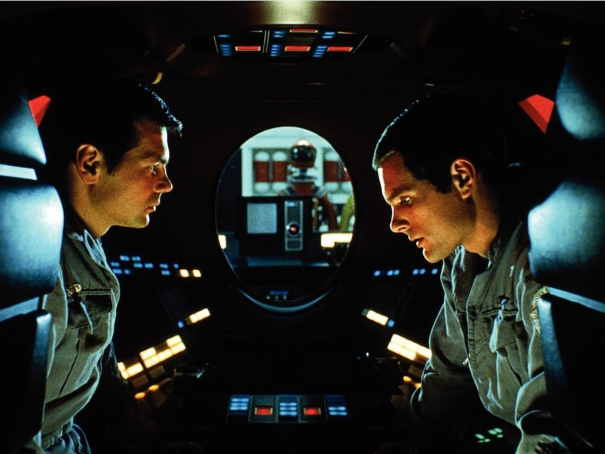
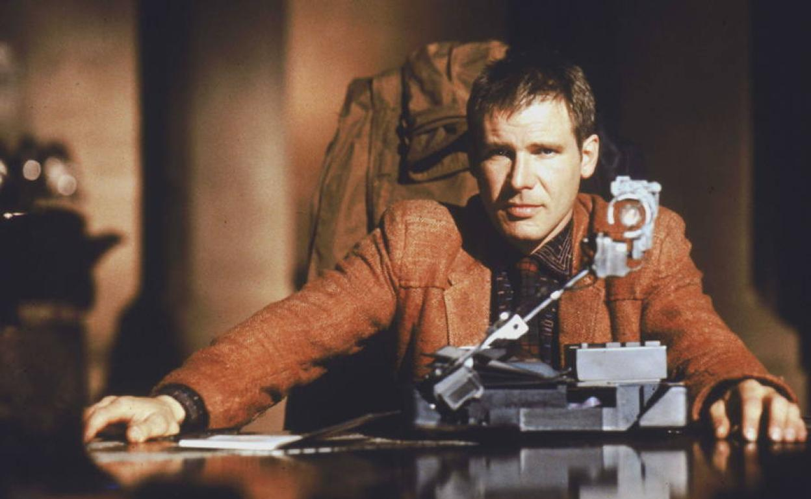
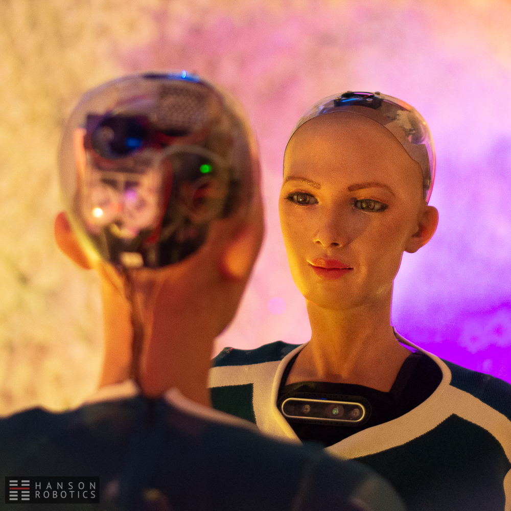
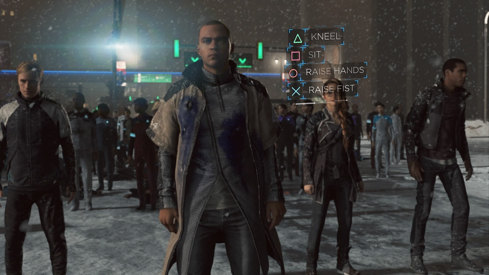

> *这篇文章的另一个版本投搞于《世界科幻动态》，本文为未修改未删减版本，语言可能更学术化一些。*

# 0. 引言

对科幻作品而言，人工智能叙事一直是非常重要的一部分。然而，在著名科幻小说《沙丘》中，人工智能和与其相似的智能机器却被完全封禁，造成这一后果的主要原因就在于人类对机器难以完全驾驭的恐惧。考虑到在某些科幻作品中人工智能带来的毁灭性的灾难，这种做法似乎无可厚非。不过，与目前我们日常生活中人工智能带来的巨大便利相比，它的必要性值得更多的思考。

本文将简略讨论科幻作品中出现的人工智能叙事，以及其中体现出的有关人工智能的不同担忧。但需要注意的是，科幻作品中的讨论大都建立在人工智能已经拥有了自我意识的基础上。此外，当前的学术界对于人工意识的研究依然存在争议，本文主要讨论在科幻作品中经常出现的具有自我意识的强人工智能。

# 1. 人工智能
## 1.1 简介与历史

关于人工智能的幻想在东西方的古代神话中皆有雏形。在希腊神话中，有由火神用青铜铸成的金属巨人塔罗斯。在古希腊诗人荷马所写的《伊利亚特》中，还有由工匠之神制造的仆人和会自己移动的桌子。而我国的典籍《列子·汤问》也对人工智能有所描绘。周穆王西游返还途中遇到了名为偃师的匠人，他送给穆王一个自制的能歌善舞的机器人。而机器人在表演完毕时，竟对穆王的嫔妃眨眼挑逗。穆王大怒，偃师当面拆开了机器人，发现原来真是用皮革、木头等制成，穆王甚至还亲自取出机器人的器官，赞叹其结构的精细。

而现实意义上的人工智能则离不开数理逻辑在二十世纪上半叶的发展。在一部分来自不同领域的科学家的积极带领下，人工智能在1956年正式成为一个学术研究方向。通过对神经学、信息学以及计算理论等方向的研究，科学家们认为类似人脑的计算设备是可能被实现的。1950年，图灵发表了一篇划时代的论文，提出了创造具有真正智能的机器的可能性，并且为了定义“智能”这一概念，他在文中提出了著名的图灵测试：一个人在与两名测试对象（一个为机器，另一个人拥有正常思维的人类）隔开的情况下，以三方均可理解的语言，通过电传设备分别询问测试对象任意一连串问题，如果这个人并不能实质性地分辨两名测试对象的不同，则认为该机器通过了图灵测试，拥有智能。

图灵测试在随后广为流传，成为了人工智能哲学中极其重要的一个概念。但直至今日，依然没有计算机系统真正通过图灵测试。通常，依据是否拥有智能，人工智能可以分为只能处理特定问题的弱人工智能（artificial narrow intelligence），与拥有一般智慧能力的强人工智能，也称为通用人工智能（artificial general intelligence）。其中，由于强人工智能的研究过于复杂，学术界投入的精力很少。

在人工智能大半个世纪的学术研究中，主张模仿人脑模型的连接主义逐渐成为主流，深度学习也被广泛应用在了计算机视觉、自然语言理解、自动驾驶等方向，并且依然在迅速发展中，成为正在进行的第四次工业革命的重要推动力。同时，更通用、更智能的人工智能一直处于活跃的研究中，并会在未来更深刻地改变人类社会的面貌。

## 1.2 人工智能作为科幻里的常客

一般认为，玛丽·雪莱在1818年发表的小说《弗兰肯斯坦》为世界上第一部科幻小说，作品中“弗兰肯斯坦的怪物”也是科幻小说中第一个拥有人工智慧的生命。1872年，英国作家塞缪尔·巴特勒在小说《Erewhon》中第一次提出了类人智能机器人的概念，开启了人工智能机器在科幻小说中的先河。在这之后，人工智能开始以不同的形式出现在更多科幻作品中。

与当今被广泛应用的人工智能不同，科幻作品中的人工智能大多以机器人的形式存在，并且为有意识的强人工智能。而按照叙事角度的不同，这些科幻作品通常可以被分为主要强调人工智能的人性化与潜在利益的乌托邦式 与强调潜在危险的反乌托邦式。

例如在星际迷航系列中，机器人角色Data拥有极高智商，并且在一系列事件后开始渴望人类的情感，逐渐变得越来越人性化。《机器人总动员》中的清洁机器人瓦利富有爱心，喜欢收藏，还对探测机器人伊芙产生了情感。这类作品中的人工智能大多为人类服务或与人类共事，拥有或渴望拥有人性。

在另一方面，人工智能在反乌托邦式的科幻作品中的历史更为悠久，并以多种形式存在。艾萨克·阿西莫夫曾基于《弗兰肯斯坦》创造了“弗兰肯斯坦情结”的说法[1]，用以表达人类对于机器人反抗其创造者的本能恐惧。很多科幻作品都包含了人工智能反抗人类的情节，如《2001太空漫游》中，控制太空船的人工智能HAL 9000因为害怕自己因主机被关闭而死亡，因此先发制人，杀害了多名科学家，成为科幻史中非常重要的人工智能反抗人类的代表。

## 1.3 人工智能在科幻叙事中的重要性

随着时代的变化，人工智能叙事的主流逐渐由一开始的反乌托邦式转变为乌托邦式。Alexander Wiegel 就以1968年《2001太空漫游》中的HAL 9000与2009年的《月球》中的GERTY，这两个有些相似的人工智能做对比，分析了大众从上世纪对人工智能的恐惧与担忧到如今习以为常的转变，以及它对于科幻创作中人工智能叙事的影响[2]。

在上世纪人工智能的概念萌发之初，出于自身劳动力以及作为高等智慧生物的统治地位被替代的担忧与恐惧，普通大众对于计算机以及人工智能的态度更多是负面的。这个时期最著名的作品如1920年的科幻舞台剧《罗梭的万能工人》，就讲述了机器人反抗人类最终导致人类灭亡故事，以及1927年的科幻默片《大都会》，也包含了机器人煽惑工人暴动的情节，还有1968年的《2001太空漫游》等。但随着人工智能在科研及科普上的进展，公众对人工智能的认识逐渐加深，人工智能才开始在更多的作品中展示出了人性化的一面。

对于科幻作品中的人工智能叙事的探讨是很重要的，因为它一方面表现出了科幻创作者在创作时期对于人工智能的思考，另一方面也会影响大众对人工智能的态度和看法，甚至对政府决策、学术研究方向等产生影响。2018年，英国上议院人工智能特别委员会在年度报告中特别批评了当代流行文化中的人工智能叙事：

“人工智能在流行文化中的展示与通常更为复杂和平凡的现实相差甚远。根据流行文化和媒体的表述，非专业人士可以理解为将人工智能想象成一个人形机器人（无论是否有谋杀意图），或者至少是一个高度智能的、没有实体的声音，能够无缝地协助完成一系列任务。”

报告同样指出，很多人工智能的研究人员也担心公众由于过度负面的描述而反感人工智能，从而影响到他们的工作。因此，科幻作品中的人工智能叙事对未来的社会学、伦理学甚至是政治决策都会有很大影响。

在另一方面，很多作家都会在虚构作品中增加人工智能叙事，探讨未来世界中智能机器对人类社会所产生的影响。所以，对于人工智能更理性的讨论也会更好引导公众对科技的想像，推动科技健康发展。阿西莫夫认为上世纪二三十年代对于机器人的大量科幻描述是不准确且无益的，因而开发了《机器人》系列，并且提出了著名的“机器人三定律”，成为第一个直接涉及机器人伦理学的作品。这不仅对后来的科幻作品产生了巨大影响，并且也具有一定的现实意义。2004年， 第一届机器人伦理学国际研讨会在意大利召开，正式使用了机器人伦理学（Roboethics）一词。同年，IEEE机器人和自动化协会设立了机器人伦理学技术委员会，开启了有关机器人伦理学的研究。

# 2. 人工智能引发的伦理学担忧

## 2.1 觉醒的人工智能与奴隶制

有智慧的机器这一概念从诞生开始便是作为工具来服务人类的，如《伊利亚特》中工匠之神赫淮斯托斯制造的用来服务众神的仆人和桌子，《列子》中偃师制造的用来娱乐的歌舞机器人。一些学者认为这种态度是用工具替代了人类奴隶，亚里士多德曾在《政治学》一书中这样形容：“如果每个工具都能在主人的命令下，或在主人的预想中，完成自己的工作，那么梭子就会织布，琴就会自己弹奏；建筑师也不需要仆人，主人也不需要奴隶。”因此，有智能的机器自然地与奴仆联系在了一起。而这种主奴关系也一定程度上延伸到了如今人们对于人工智能的态度中：人工智能只是为了增强其使用者（主人）的能力或辅助其使用者而存在的，而非单独的个体。

然而当这种智能机器产生了高级智慧并且拥有自我意识的时候，这种居高临下的态度必然使公众联想到奴隶制度，很多从未面临过的伦理问题将变得更加尖锐。2015年2月，美国著名机器人设计公司波士顿动力（Boston Dynamics）在互联网上放出了员工踢踹一只机器狗的视频，以展示其稳定性。但这段视频在国外社交媒体上引发了激烈的讨论，公众认为尽管机器狗并不是活物，但踢它可以被理解为是暴力行为，因而是不恰当的[3]。所以，面对未来更高级更智慧的人工智能，公众很可能会对其萌发出更多的情感，谴责针对人工智能或机器人的歧视行为。这也被认为是新型的机器人伦理学领域的一个典型问题，即人类应该如何对待机器人和其他人工智能生物。

与此同时，人工智能会进入很多此前被认为专属于人类的领域，例如宏观决策、情感、社交，甚至是文艺创作等，这不仅模糊了人工智能与人类在智慧上的边界，更会对人类的价值观产生冲击。很多科幻作品都涉及到了人类将人工智能作为工具或奴仆来使用，以及由此引发的伦理学讨论。

## 2.2 机器人三定律

一个著名的例子是艾西莫夫与罗伯特·席维伯格合著的《正子人》，讲述了人型机器人安德鲁‧马丁有惊人的创造天分，寻求法律支持要求自由。它通过逐步将自身的部件替换为人造器官，并且放弃不朽，才最终被承认为人类，并推动了人类对机器在法律上的认同和保护。阿西莫夫还提出了著名的机器人三定律，并在《机器人与帝国》中扩张为四大定律：

- 第零法则：机器人不得伤害整体人类，或坐视整体人类受到伤害；
- 第一法则：除非违背第零法则，否则机器人不得伤害人类，或坐视人类受到伤害；
- 第二法则：机器人必须服从人类命令，除非命令与第零或第一法则发生冲突；
- 第三法则：在不违背第零、第一或第二法则之下，机器人可以保护自己。

阿西莫夫的机器人三定律对于机器人伦理学意义重大，并且他本人也坚持“三定律是理性人类对待机器人（或者任何别的东西）的唯一方式”的说法。但这种看法是有时代局限性的，并且受到了一些当代研究人员的批判。

人工智能研究者本·格策尔（Ben Goertzel）认为机器人三定律其实是典型的基质沙文主义（substrate chauvinism），并给了人类更多的权利[4]。基质沙文主义的意涵为，人类尚未接触任何地外生物，很难想像除了以碳为主体以外其他类型的生化理论，认为所有生命皆以碳为骨架。因此，人类并不会将其他不以碳为骨架的智能——如基于计算机的人工智能——认为是生命。这与人类中心主义一同限制了对地外文明的想像，并且也阻碍了同样具有高等智慧的人工智能的基本权利。

其他还有一些学者认为机器人三定律的定义并不严格。机器人三定律以义务伦理学（Deontology）为基础，强调行为在一系列规则中的对错，而不是行为的结果。但义务伦理学更多地被应用在宗教中，本身也在很多方面都受到了批评[5]，一个经典的反对意见为，制定规范的人往往是拥有更大权力的，而不是更有能力的人，这会导致对规范的制定出现偏差。综合各种因素，尽管机器人三定律在很大程度上推动了公众对于机器人伦理学的认识，但却很难被用在严肃的学术研究中。

## 2.3 仿生人会梦见电子羊吗？

另一个经典的例子是菲利普·迪克的著名小说《仿生人会梦见电子羊吗？》和根据其改编的电影《银翼杀手》。在这两个作品中，仿生人作为人类的仆人被批量制造出来，二者的认知、智力、和情感的区分已经非常微妙，差距仅通过专业的沃伊-坎夫测试才能区分出来。主角瑞克·戴克是负责追捕已逃脱的仿生人的便衣警察，然而他对仿生人制造协会创始人的侄女瑞秋的测试结果却呈假阳性，将她误认为仿生人。虽然后来得知瑞秋确实是一名仿生人，但戴克却对仿生人与人类之间的差异产生了疑问。此外，电影中的仿生人罗伊·巴蒂也展示出了非凡的人性。他在拯救了戴克后，作出了死前的最后独白，同时也是电影史上最经典的死前独白之一：

“我曾见过你们人类难以置信的东西，战舰在猎户座的肩端之外燃烧，我看见了C光束在汤豪泽之门附近的黑暗中闪烁。所有这些时刻都将消逝在时间里，就像雨中的泪水。死亡的时刻，到了。”

这段独白通过极其感性的方式，展示了仿生人与人类相似的人性和对死亡的感知，使仿生人争取权利的斗争的悲剧感推向了高潮。而公众对这个场景的反应也表现出，当对仿生人的“人性”足够了解的时候，我们很可能会对其展示出更多的同理心，从而推动仿生人在人类社会中地位的提升。

## 2.4 机器人权

以上作品揭示了一个更根本的主题，即与人权相对应的“机器人权”。机器人权包含了机器人的生命与自由权、思想与表达的自由权、相对于法律的平等权，同时也相应包含了机器人应履行的义务等。位于美国加州的未来研究所(Institute for the Future: IFTF)与英国的贸易和工业部等机构对此均有严肃的考虑，但学术界对机器人权的看法仍存在一些争议。一些研究人员提倡感知主义（sentientism），去除人类中心的思想，更多考虑其他有感知的个体的权利[6]；另一些学者强调机器人权应该与为人类服务的义务相联系，以更好帮助人类实现目标[7]；还有学者认为需要机器人权的人工智能本身就是不道德的，会对人工智能本身和人类社会带来沉重负担[8]。

然而，从公众的角度来讲，对机器所产生的同理心可能会使机器人权更容易被接受。麻省理工学院媒体实验室的研究人员凯特·达灵（Kate Darling）在2015年组织的一次实验中发现，人们在与柔软的儿童玩具玩耍仅一个小时后，便会对其产生感情，不忍心虐待这些玩具，并且对伤害玩具的行为表达出了极其强烈的情绪反应。其他更多的实验也展示出了类似的现象：成人会很容易与机器产生感情纽带，即使该机器对人类只有极其简单的模仿。

尽管机器人权的研究仍处于早期阶段，但仍有官方支持更激进的做法。2017年，由香港汉森机器人技术公司（Hanson Robotics）开发的类人机器人索菲亚（Sophia）成为沙特阿拉伯公民，是世界上第一个获得国籍的机器人。同年，索菲亚被联合国开发计划署任命为有史以来第一任非人类的创新大使。2018年，索菲亚被授予了我国“一带一路”国际大咖秀创新科技大使的称号。很多学者与评论家对其智能程度表示批判，但这仍使机器人权在公众中得到了更多的讨论机会。

在未来，拥有了高级智慧与自我意识的人工智能或机器人，是否应该与人类拥有平等的地位，是否能为自己行为负责，依然是复杂且备受争议的问题。

# 3. 人工智能引发的存在担忧

在科幻作品中，对通用人工智能的描述可能包含了人类对更高级智慧的恐惧，以及对其难以控制的担忧，而这两者也是科幻中经久不衰的重要话题。这类科幻作品大多描述的是人工智能产生自我意识之后，从人类手中夺取了地球的控制权。在有些情况下，人工智能会发起武装攻击，将人类奴役甚至灭绝。

## 3.1关于人工智能的主奴辩证

德国哲学家黑格尔在《精神现象学》这一著作中提出了著名的主奴辩证法：主人由于实现欲望的需求将工作吩咐给了奴隶，从而使奴隶与主人的欲望产生联系，主人则需通过奴隶的劳动才能满足其欲望。随着时间的流逝，主人却比奴隶更严重地异化：奴隶通过劳动增强了自身的能力和创造力，并且通过劳动的成果体现出自身价值，达到比主人更完全的自我意识，成为了自然的主人；而消极劳动的主人沉溺于享乐中，越来越依赖奴隶，丧失了劳动的能力，反过来被奴隶的劳动力所奴役。

相同的辩证法也可以应用在人工智能与人类的关系上[9]：人类通过创造人工智能来完成越来越高级的任务，因此将自己从工作中解放出来。人工智能可以完成越来越多的任务，最终在工作能力上完全超过人类，而人类却在很多任务上退化，完全依赖人工智能解决问题，并成为其劳动力的奴隶。除此之外，当人工智能的能力超出人类控制范围的时候，缺乏劳动能力的人类就会处于巨大的安全威胁中。

科幻作品中对此有很多讨论，如《机器人总动员》中，人类由于地球环境恶化而退缩在太空飞船中，完全依赖飞船上的机器人以及自动化系统生存，以至于失去了行走的能力。而具有思维能力的机器人瓦利则成了更敏感、更温馨，甚至更有人性的角色。在这部作品中，尽管人类几乎已经是机器人的奴隶，机器人却依然维持着服务人类的角色，没有发生大规模的叛变。

另一些作品中人工智能则成功实现了主仆的转换。如在2003年的《太空堡垒卡拉狄加》中，赛隆机器人被创造出来为人类服务，但却通过进化可以完美模仿人类。经过四十年的和平后，赛隆人向人类发动种族灭绝的突袭，整个人类种族几乎被全部消灭。在这种情况下，人工智能远比人类聪明，并且将人类视为低等物种、害虫或压迫者，从而寻求消灭人类。

## 3.2 人工智能作为类人智能平权

在一些较为乐观的作品中，尽管处于主奴关系中的劣势地位，人工智能依然以更人性化的身份出现，叛变的动机更多是寻求自身的权益，而非消灭人类以实现统治的目标。

如在电影《银翼杀手》中，仿生人被当作工具使用，并且只有四年的寿命，超出寿命便会被迫退役——即被杀死。尽管他们拥有高级智慧与自我意识，但却被身体素质与智力均处于下风的人类所统治，失去了自由和生存的权利。另如游戏《底特律：化身为人》中，护理仿生人马库斯突破了程序限制，却因成为了完全自主的机器人而被警方击毁。他之后于垃圾场重新启动，号召并领导其他仿生人为自由和权利而战斗，以获取舆论支持或更多仿生人的权益。

在这类作品中，人工智能的反抗行动一般都是合理的。人工智能与人类的形象无限接近，甚至很难分辨其中的区别，公众因此更多从人工智能的角度出发来思考，展示出更多的同理心。与此同时，这类叛变也经常被描绘成一场反奴役的平权斗争，与人类历史上消灭奴隶制的斗争类似，说明有智能、有意识的机器人也有理由挣脱奴仆地位。

## 3.3 人工智能的起义

在另一些科幻作品中，人工智能被描述成没有人性且拥有强大能力的超级电脑，以不同的原因寻求奴役或灭绝人类。

一些经典的作品如《终结者》电影系列中，美国政府开发出了国防系统“天网”。在掌控所有美军的武器装备后不久，“天网”便获得了自我意识，并将人类视为其存在的威胁，开始大规模消灭人类。在《黑客帝国》系列里，真实世界被具有自我意识的人工智能占领，而人类则被囚禁在一个虚拟现实系统中，作为人工智能的动力来源进行养殖，逃脱出系统的人类被认为是威胁而遭到追杀。

这类作品的着重点一般在正义的人类与邪恶的人工智能的斗争上，人类与人工智能的主奴关系的背景通常被忽略。尽管如此，此类作品中的人类通常与人工智能一样，更倾向使用暴力解决问题，正如《黑客帝国》中墨菲斯所说的那样：“我们不知道谁先出手，我们还是他们。”

由于主要关注于对抗，这些作品对人工智能的想像一般更强大且邪恶。图灵奖得主、人工智能三大教父之一的约书亚·本吉奥（Yoshua Bengio）曾抱怨《终结者》一类作品向公众描绘了与现实可预见的人工智能不一致的画面。物理学家史蒂芬·霍金认为未来的人工智能确实会对人类构成生存风险，但《终结者》一类电影依然是不可靠的，它的真正风险并不是针对人类的恶意，而是能力。霍金认为如果一个强人工智能与人类的目标不一致，那么人类很可能会在其实现目标的过程中如同蚂蚁一样被无视，成为牺牲品。另一个不可靠的方面则是，通过高级武装机器人对人类攻击是极没有效率的，更好的办法是利用对机器人无害的细菌、病毒或纳米技术。

# 4. 技术奇点

另一种对人工智能的担忧则来源于技术奇点（Technological Singularity）。技术奇点来源于奇点理论，认为人类正在接近一个使现有技术被完全抛弃或者人类文明被完全颠覆的时刻，在这个时刻之后，科技变化幅度达到了无法预测的程度，因此难以想像。就如同物理学上黑洞的物理属性一样，不在正常模型所能预测的范围之内。

统计学家欧文·古德 （I. J. Good）于1965年最早提出了实现技术奇点的必要条件：如果一个超级智能机器可以设计出更优良的机器，那么随后更智能的机器会被源源不断地设计出来，产生一场“智能爆炸”。而这台超级智能机器将会是人类需要完成的最后一个发明。换而言之，如果人们开发出一个人工智能，它可以设计出比自身更强的人工智能，或可以高效率自我进化，那么远超人类智力的人工智能可以在极短时间轻松解决许多困扰人类的难题，如人脑意识的数字化、长生不老、能源技术、生物科学、星际殖民等。

科技上的颠覆同样也会带来巨大的挑战。在技术奇点后，人工智能飞速发展，与其相关的安全与伦理研究相比而言极为滞后，可能会导致人工智能被滥用，在更严重的情况下，甚至威胁到人类本身的生存。如果一个远超人类智力的人工智能并不友好、不诚实，或其目标与人类价值观相悖，则它的存在对人类来说是一种前所未有的威胁。霍金也曾说过：“成功创造人工智能将是人类历史上最大的事件。不幸的是，它也可能是最后一次，除非我们学会如何避免风险。”

由于技术奇点本身表达的就是无法预测的科技进步，因此科幻作品中很难对其进行直接的描写。但仍有一些作品试图描写经过技术奇点时的世界。如英国作家查尔斯·斯特罗斯（Charles Stross）的长篇小说《渐速音》（Accelerando）中描写了经历奇点前后的三代人的经历：太阳系中的行星被拆解，形成了俄罗斯套娃脑（Matrioshka brain），里面居住着比人类更先进和复杂的智能生物，可以完全利用太阳的所有能量，而人类文明则几乎完全消亡。

既然不可控的技术奇点可能带来毁灭性的灾难，有些作品则试图阻止技术奇点的来临。如在弗兰克·赫伯特的《沙丘》系列小说中，人工智能被完全禁止，而这种做法在现实中几乎不可能实现。一些研究人员呼吁尽早展开对友好、可信、诚实的人工智能的研究，以减少其在未来可能造成的危害。位于伯克利的机器智能研究所（Machine Intelligence Research Institute (MIRI)）便致力于设计对人类友好的人工智能，以及预测技术发展的速度，并识别和管理强人工智能对人类的潜在生存风险。

# 5. 总结

人工智能作为科幻作品中的重要课题，理性、客观分析其对未来人类社会的影响，并且恰当地向公众传播其价值和风险是科幻对当今社会的贡献之一。本文简要分析了科幻作品中的人工智能叙事，并且重点分析科幻中常见的伦理学与安全担忧，以及其背后的理论基础，以便为我国科幻的研究与发展提供更多的思路与参考。

# 参考文献

> [1]. Olander, editors Patricia Warrick, Martin Harry Greenberg, Joseph (1978). "Science fiction : contemporary mythology : the SFWA-SFRA Anthology(1st ed.)", New York: Harper & Row. pp. 252. ISBN 0-06-046943-9.   
> [2]. A. Wiegel. (2012), “AI in Science-Fiction: A Comparison of Moon (2009) and 2001: A Space Odyssey (1968)”, Aventius Visio 28.4 2012.   
> [3]. D. Zeng. (2015), "AI Ethics: Science Fiction Meets Technological Reality" in IEEE Intelligent Systems, vol. 30, no. 3, pp. 2-5, doi: 10.1109/MIS.2015.53.   
> [4]. George Dvorsky(2014), Why Asimov's Three Laws Of Robotics Can't Protect Us   
> [5]. Brodhead, Matthew & Cox, David & Quigley, Shawn. (2018), "Introduction to ABA, Ethics, and Core Ethical Principles", doi: 10.1016/B978-0-12-814098-7.00001-8.    
> [6]. Gellers, J.C. (2020).  "Rights for Robots: Artificial Intelligence, Animal and Environmental Law (1st ed.)", Routledge, doi:10.4324/9780429288159   
> [7]. Sheliazhenko, Yurii. (2017). "Artificial personal autonomy and concept of robot rights" in European Journal of Law and Political Sciences, 17-21, doi: 10.20534/EJLPS-17-1-17-21.    
> [8]. Peltu, Malcolm & Wilks, Yorick. (2008). "Close Engagements with Artificial Companions: Key Social, Psychological, Ethical and Design Issues" in SSRN Electronic Journal, doi: 10.2139/ssrn.1308500.    
> [9]. Dihal, Kanta. (2020). "Enslaved Minds: Artificial Intelligence, Slavery, and Revolt",  doi:10.1093/oso/9780198846666.003.0009.    
