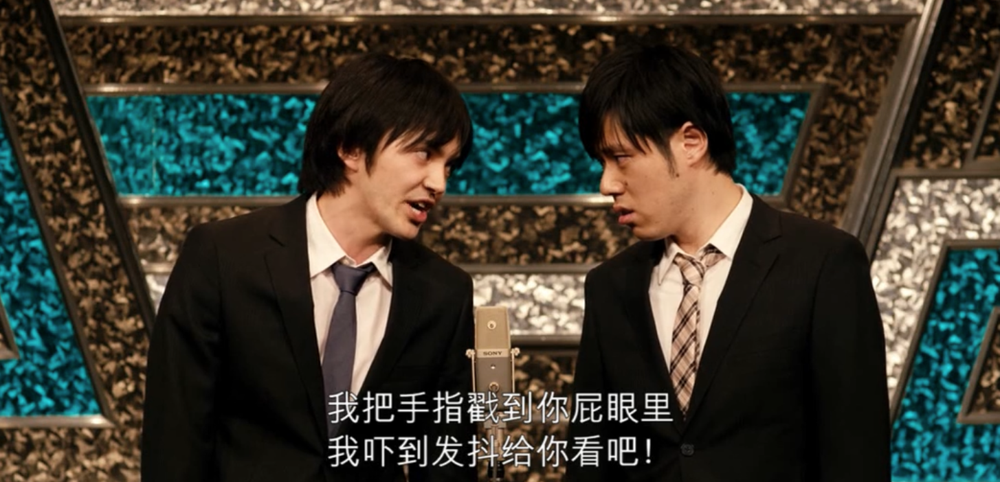

*关于我是如何到现在才发现这个事实的，以及我为了什么而愤怒*

公司的实验室里之前有个摩洛哥小哥，现在已经博士毕业，去别的地方工作了。他看书很多，我知道的所有欧美作家他都看过，算是我熟悉的人里面文学哲学懂的最多，逻辑思维最清楚的人了，每句话都严丝合缝，几乎没有说错话的时候。但每次我说“你看书挺多的”这种话的时候，他都摆摆手，“没有没有，我看书很少的”。

他很喜欢和人聊天，似乎和公司里所有人都有来往。大部分工作日的下午三四点，他都会和别人一起喝咖啡，一聊就是大半个小时一个小时，讨论着什么小说戏剧或者其他关于道德或者其他形而上的话题，这更让我佩服。能和这么多人分别找到能聊起来的不琐碎的话题确实不容易。

“我是一个很抑郁的人”，他是这么评价自己的，“最喜欢抑郁的东西了。”他有时候也会说，“我喜欢奇怪的东西”。于是在他离开实验室的时候，我送给他两本书，一本太宰治的《人间失格》，一本《聊斋》，分别对应着抑郁和猎奇，他人生的两大主题。本来打算送我认为更抑郁的太宰的《斜阳》，但书店里没有找到，只好作罢。

和他第一次正经聊天的时候，我先提了句，“我挺喜欢加缪的”，然后他非常开心，聊了大半个小时，对了对我们喜欢的作家，他得出结论，“我们口味很像”。

我们的口味很像吗？

于是我开始思考，我和面前的这个来自北非的阿拉伯小哥的口味是不是真的很像。从某些角度看上去确实是，我们都喜欢致郁的东西，都喜欢看书但都声称看得很少，都喜欢加缪，都同意纳博科夫是另一个级别的作家，都认为菲利普罗斯非常有意思，都觉得 Édouard Louis 挺好但是欠点火候。我们还都是失去了祖国的外国人。

我们又有一些很明显的不同。比如他尤其讨厌青少年小说，而我最喜欢的书之一就是《麦田里的守望者》；他更喜欢生活在精神世界里，对工作技术和物质都没有任何追求，“你可以拿走我任何东西，我都不介意”，而我却周期性技术工具狂热并且很容易陷入消费陷阱里。他总是平静祥和的，随时都可以微笑着开始聊天，而我很难控制自己的情绪，大部分时候并不想和别人开始对话。

我想我要是他那样的性格，可能生活会更顺心一点，但总觉得这样有些无趣，缺了点什么。

---

所以到这里，我产生了很多个疑问。
1. 他的喜好和性格非常清晰，抑郁和猎奇。如果给我找个主题，那应该是什么？
2. 明明以为文学口味很像，那为什么我们对青少年小说意见差距这么大？
3. 我觉得无趣的时候，到底缺失了什么？

首先，我确实喜欢抑郁的东西。致郁的作品在情绪上让我感到安全、满足和平静，就像毫无希望的自由落体，在享受下坠的快感后撞击触地。因为情绪已经触及了谷底，就能放心享受虚构作品带来的被单纯的负面情绪包围的平静和充实，生活中的失落和沮丧已经不足一提，也不必为了任何事情而努力。放松，就像失去了一切希望，也不去承担任何责任。这就像精神鸦片一样，让我逃避现实世界，在只属于自己的世界里放松休息。

但我并不猎奇。不知道为什么，只是不感兴趣。它对我的吸引力可能就像抖音短视频一样，偶尔看一两个没有什么问题，但从来不会主动去看，也不会沉迷。当小哥给我激情推荐《骰子人生》的时候，我只是想，这想法不错，但并没有想要看的欲望。但有意思的是，当我觉得日剧《火花》里的段子都很有趣的时候，很多人却说干枯无味。所以这可能只是单纯的口味不同。

青少年小说，终于。为什么他不喜欢青少年小说，甚至青少年这一整个群体，“又蠢又幼稚”，再加上一些青少年的毫无必要的叛逆精神，确实，没有人会喜欢吵闹又自以为是的人。既然这样，为什么我喜欢《麦田里的守望者》？因为他真诚，善良，单纯，同时他愤怒，为了任何其他人已经麻木了的鸡毛蒜皮的冷漠和不公。

是最后一点，给了当时还在初中的我很大的冲击，感觉就像突然开了窍，妈的，人竟然可以这么潇洒地活。不只为自己的衣食住行操心，而是问，中央公园的鸭子冬天去哪儿了。有意义吗？有。有人在乎吗？没有。

如果仔细回想这种愤怒在我身上成长的痕迹，那可能得写本几十万字的没人在乎的自传出来。但总而言之，结果是，我成了个生活在自己的理想世界里的愤世嫉俗者。

愤世嫉俗，是的，就是这么幼稚，离三十也不远的人了，还愤世嫉俗，脑子有问题吧？我查了查词源，是在韩愈的《崔山君传》里：“然吾观于人，其能尽其性而不类于禽兽异物者希矣，将愤世嫉邪长往而不来者之所为乎？”。大概意思是，能有人性但又不像禽兽的人太少了，而且这群人都愤世嫉俗，隐居避世。这下我放心了，韩愈亲口说的，愤世嫉俗可能并不幼稚，只是贯彻人性的一个结果。我觉得挺有道理，古人诚不我欺。

---

所以我究竟在愤怒什么？

刚才说过了，冷漠和不公。

冷漠应该用道德解决，不公应该用法律解决。但是如果因为各种原因，道德和法律没有完成各自任务的时候，我就会愤怒。

但是问题来了，道德和法律都是有相应的价值观和世界观支撑的，愤怒也是。假如一个人对工作不求上进，只是喜欢享受生活，我应该为这个人对“浪费”人生，没有努力社会价值而愤怒吗？不应该。假如一个人全心工作，同时胁迫别人和他一起自愿义务加班为世界创造价值，我应该愤怒吗？应该。

所以在愤怒之前，首先得确定，我愤怒的是正确的事情，不然我只是千千万万自以为是戾气十足的网民而已。于是我有了以下几条非常朴素的原则：

- 法律应该是平等，公正和正义的
- 每个人都应守法
- 每个人都应有按照自己的价值观生活的权利，只要不危害到别人
- 每个人都不应该用隐瞒部分或全部真相的方式诱使或强迫他人做出不利任何人的决定
- 每个人应该尽可能有同理心
- 使用[无罪推定原则](https://zh.wikipedia.org/zh-cn/无罪推定原则)，即每个人应首先假定无罪，除非有确定的证据

这几个原则并不固定，实际上这只是我用几分钟即兴想出来的。但我们暂且应付一下，以后有想法了再改进。

这几个原则有一些小问题。第一个关于公正，因为公正是建立在价值观上的，一千年前的公正和今天的公正可能截然不同。那如何确定一个法律是公正的，而不是恶法呢？我不知道。一个可能的出发点是，法律应该代表社会中每个人在完全知情并且尽可能保护弱势群体的情况下，大部分人愿意做出的让步。但我对法律本身一无所知，只能做到简单的标准：少有争议、没有偏见且符合常识的法律是好的，争议较大、有偏见或不符合常识的法律是不好的。

另一个问题是同理心。首先应该知道的是，同理心不是每个人都有，而且大部分人的同理心都局限于自己能直接感受到的人，类似于“齐宣王不忍宰牛衅钟，以羊易之”的典故。因为看到待宰的牛因恐惧而发抖，就换去宰他看不到发抖的羊。如果他看到了那只羊也吓得发抖呢？如今网络暴力猖獗一部分也是因为人感受不到网络那头活生生的人，以为那只是个符号，而看不见对方的发抖。

但为什么这是个问题？因为每个人对同理心的理解都是不一样的。即使只有最少的同理心的人，也可能认为自己擅长同情、关心别人。任何自己没有同理心的行为都会被解释为自己主持正义，或对方有错在前，或对方小题大作，或“我也不是情绪垃圾桶”，或“我在帮他客观解决问题”，等等等等。甚至很多网暴者直到受害者自杀身亡都认为自己是正义的化身，不会有丝毫反思。

有人可能会问，大家都尽可能有同理心那不成圣母婊了吗？并不是，圣母婊的特点在于无原则无底线包容他人，不符合第三和第四条原则。动动你的小脑子。

那么有办法能做到这点吗？我不知道，但我坚持这点应该在上述原则内，因为我还记得在2011年，2岁的小悦悦先后被两辆汽车撞倒，18名路人视而不见的时候，所有人对国民素质的质疑。我应该对那18名路人愤怒吗？应该。为什么？因为第五条原则，他们没有同理心。如果没有这条原则，我就没有正当理由愤怒了。更况且，孟子曰：“无恻隐之心，非人也”。

另外一提，最后一条无罪推定是为了避免基于片面或错误的信息做决定，从而认为某个人有错或者某件事不公正。这在现在错误信息发达的时代尤其重要，可以始终保持理性，避免成为网暴施害者。

---

以下是一个案例分析。

最近[徐州八孩母亲事件](https://zh.wikipedia.org/zh-cn/徐州八孩母亲风波)，应该愤怒吗？

第一个原则，应该愤怒。法律并不平等，人口贩卖买卖不同罪，罪罚过轻。“女性地位不如鹦鹉癞蛤蟆”，荒谬代表了现实的时候，法律就助长了不公正。且官方在调查中多次改口，时至如今终于到了完全无法平民意的程度。

第二个原则，应该愤怒。人口买卖违法。

第三个原则，应该愤怒。人口买卖、非法拘禁，强奸生子。

第四个原则，应该愤怒。胁迫母亲做的一切事情。

第五个原则，应该愤怒。所有数十年知情却无动于衷的人，他们一起造就了这个悲剧。

所以应该怎么办？因人而异。

什么也不做？也没问题。并不是每个人都应该关心每一个社会事件。但保持愤怒的能力，可以当有些事情发生在自己身边的时候，人性还在。

---

因此，目前为止，我终于暂时确定我的愤怒是正确的，并且不会伤害无辜。

现在再回到开始关于摩洛哥小哥的几个问题，答案就很明朗了。

- 如果给我找个主题，那应该是什么？
	- 是愤怒和抑郁。愤怒是行动的动力，抑郁是休养和调节。
- 为什么我们对青少年小说意见差距这么大？
	- 因为我更喜欢青少年的愤世嫉俗。
- 我觉得无趣的时候，到底缺失了什么？
	- 缺失了让社会变好的强烈欲望，缺失了对生活中的冷漠和不公的反抗。

我为什么愤怒？因为愤世嫉俗。

我可以不愤怒吗？不可以，天性难改变。

愤怒有坏处吗？有，会影响情绪，影响学习工作。

愤怒有好处吗？有，保持人性。

所以愤怒值得吗？值得。

我是愤怒。

